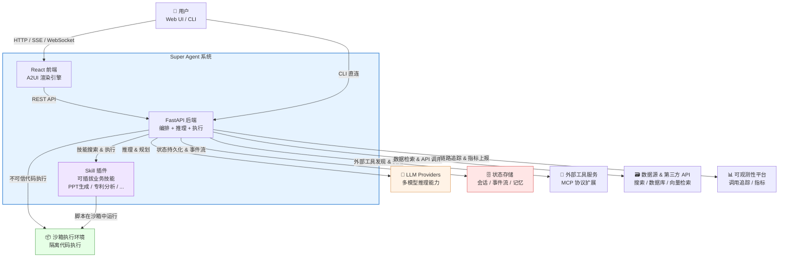
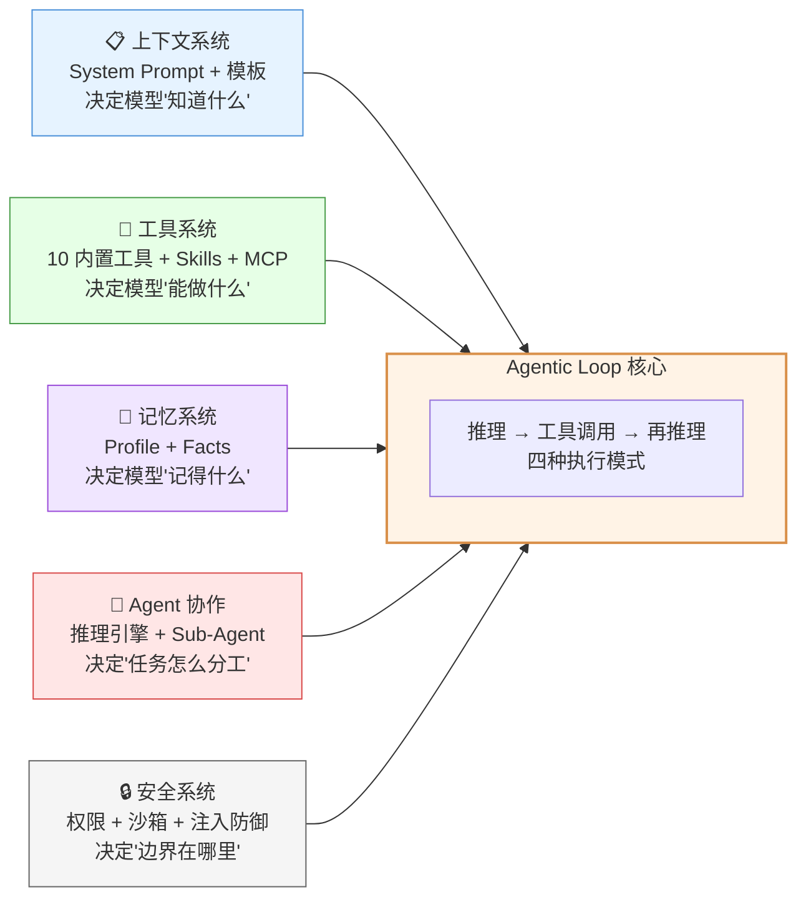

# C4 Level 1: 系统上下文

Super Agent 是一个企业级混合 AI Agent 引擎，通过 Python 控制面进行高层编排，通过沙箱化的 Pi Agent 进行自主代码执行，为用户提供复杂任务的智能拆解与自动化完成能力。

## 系统上下文图

## 架构全景：五大支柱

系统内部围绕 Agentic Loop（推理-工具调用-再推理循环）构建，由五大支柱支撑：

| 支柱 | 职责 | 对应模块 |
|------|------|----------|
| 上下文系统 | 12 段模板动态组装 System Prompt，按执行模式注入不同指令 | `context/` |
| 工具系统 | 10 个内置工具 + 可插拔 Skill + MCP 外部工具，三阶段渐进加载 | `capabilities/` |
| 记忆系统 | 用户画像 + 事实记忆，跨会话持久化，200ms 超时降级 | `memory/` |
| Agent 协作 | 五维度复杂度评估 → 四种模式路由 → Sub-Agent 委派 | `orchestrator/` + `agents/` |
| 安全系统 | 工具级权限、沙箱隔离、Prompt 注入检测、审计日志 | `security/` |

横切关注点：`streaming/`（事件流）、`monitoring/`（可观测性）、`llm/`（模型路由）、`billing/`（计费）贯穿所有支柱。

---

## 外部系统说明

| 外部系统 | 角色 | 当前实现 | 必需? |
|----------|------|----------|-------|
| LLM Providers | 推理决策、任务规划、文本生成 | Claude / GPT / Groq / Mistral (via LiteLLM) | 是 |
| 状态存储 | 会话状态、SSE 事件流、用户记忆、分布式锁 | Redis (Stream + Hash + SortedSet) | 是（降级可运行） |
| 沙箱执行环境 | 隔离执行不可信代码（Pi Agent） | E2B Cloud / 本地子进程 | 是 |
| 外部工具服务 | 通过标准协议扩展工具能力 | MCP Server (SSE) | 否 |
| 数据源 & 第三方 API | 搜索、结构化查询、向量检索 | 百度搜索 / PostgreSQL / Milvus | 否 |
| 可观测性平台 | LLM 调用追踪、Token 成本、Prompt 调试 | Langfuse / ARMS | 否 |

## Skill 插件系统

Skill 是系统内的可插拔扩展单元，每个 Skill 包含文档（SKILL.md）和可执行脚本，通过三阶段渐进加载集成到 Agent 能力中：

1. 启动时注入摘要（名称 + 一行描述）到 System Prompt
2. 运行时按需搜索完整文档和参数
3. 执行时将脚本注入沙箱运行

当前已有 Skill：AI PPT 生成、专利法律状态查询、TRIZ 降本分析等。支持自定义扩展。

## 核心价值主张

- 宏观编排（Python）+ 微观执行（Pi Agent）的混合架构
- 四种执行模式（DIRECT / AUTO / PLAN_AND_EXECUTE / SUB_AGENT）智能路由
- 控制面与数据面隔离，不可信代码在沙箱中执行
- 渐进式工具加载，避免 Prompt 膨胀
- 后端驱动 UI 渲染（A2UI 协议）
