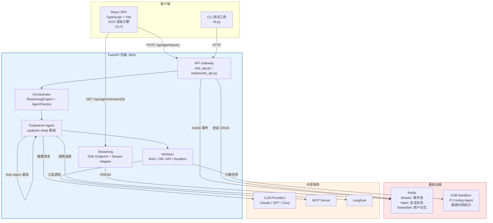

# C4 Level 2: 容器视图

## 容器架构图



## 容器清单

### FastAPI 后端

| 属性 | 值 |
|------|-----|
| 语言 | Python 3.12 |
| 框架 | FastAPI + Uvicorn |
| Agent 框架 | PydanticAI + pydantic-deep |
| 默认端口 | 9001 |
| 入口 | `src_deepagent/main.py` |
| 启动命令 | `python run_deepagent.py` |

核心职责：接收请求 → 推理决策 → 创建 Agent → 执行任务 → 推送事件流。

### React 前端

| 属性 | 值 |
|------|-----|
| 语言 | TypeScript 5.6 |
| 框架 | React 18.3 + Vite 6.0 |
| 关键依赖 | ECharts 5.5, xterm 5.5 |
| 默认端口 | 5173 |
| 入口 | `frontend-deepagent/src/main.tsx` |

核心职责：SSE 事件消费 → A2UI 动态组件渲染 → 用户交互。

### Redis

| 用途 | 数据结构 | Key 模式 |
|------|----------|----------|
| SSE 事件流 | Stream | `stream:{session_id}` |
| 会话状态 | Hash | `session:{session_id}` |
| 对话历史 | List | `conversation:{session_id}:messages` |
| 用户记忆 (Profile) | Hash | `memory:{user_id}:profile` |
| 用户记忆 (Facts) | SortedSet | `memory:{user_id}:facts` |

### E2B Sandbox

| 模式 | 隔离级别 | API Key 方式 | 适用场景 |
|------|----------|-------------|----------|
| Local | 无（子进程） | 直接使用宿主 Key | 开发调试 |
| E2B Cloud | 完整容器隔离 | 临时 JWT (10min) | 生产环境 |

沙箱内运行 Pi Coding Agent，通过 JSONL 协议与宿主通信。

## 通信协议

```
┌──────────┐  REST (JSON)   ┌──────────┐  Redis Stream  ┌───────┐
│  前端/CLI │ ──────────────→│  后端    │ ──────────────→│ Redis │
│          │  SSE (text/    │          │  XADD/XREAD   │       │
│          │  event-stream) │          │                │       │
│          │ ←──────────────│          │ ←──────────────│       │
└──────────┘                └──────────┘                └───────┘
                                │
                    ┌───────────┼───────────┐
                    ▼           ▼           ▼
              ┌──────────┐ ┌────────┐ ┌──────────┐
              │ LLM API  │ │  E2B   │ │   MCP    │
              │ (HTTPS)  │ │(HTTPS/ │ │  (SSE)   │
              │          │ │ Local) │ │          │
              └──────────┘ └────────┘ └──────────┘
```

| 路径 | 协议 | 说明 |
|------|------|------|
| 前端 → 后端 | HTTP REST | 提交查询、获取状态 |
| 后端 → 前端 | SSE (Server-Sent Events) | 实时事件推送，支持断点续传 |
| 后端 → Redis | Redis Protocol | 事件存储、会话管理、记忆读写 |
| 后端 → LLM | HTTPS (OpenAI 兼容) | 通过 LiteLLM 统一路由 |
| 后端 → E2B | HTTPS / 本地子进程 | 沙箱生命周期管理 + 代码执行 |
| 后端 → MCP | SSE (MCP Protocol) | 外部工具发现与调用 |
| 后端 → Langfuse | HTTPS | 异步上报追踪数据 |

## 技术栈总览

| 层级 | 技术 | 版本 |
|------|------|------|
| 后端框架 | FastAPI + Uvicorn | - |
| Agent 框架 | PydanticAI + pydantic-deep | - |
| LLM 路由 | LiteLLM | - |
| 前端框架 | React + Vite | 18.3 / 6.0 |
| 缓存/消息 | Redis | - |
| 向量数据库 | Milvus | - |
| 沙箱 | E2B (Tencent) / Local | - |
| 监控 | Langfuse + OpenTelemetry | - |
| 配置管理 | Pydantic BaseSettings + .env | - |
| 包管理 | Poetry (pyproject.toml) | - |
