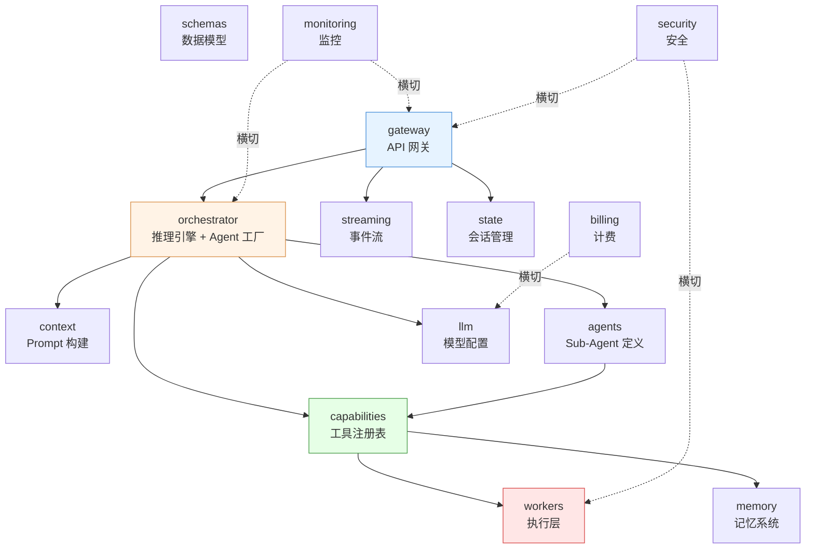

# C4 Level 3: 组件视图

## 模块依赖关系



---

## 各模块详解

### 1. gateway — API 网关

职责：接收外部请求，路由到内部服务，管理请求生命周期。

| 文件 | 职责 |
|------|------|
| `rest_api.py` | REST 端点：`POST /api/agent/query`（提交查询）、`GET /api/agent/stream/{id}`（SSE 事件流）、状态/指标查询 |
| `websocket_api.py` | WebSocket 端点（备选通道） |

对外接口：
- `submit_query(request)` → 生成 session_id，启动异步编排任务
- `configure(workers, redis_client)` → 注入运行时依赖
- `init_workers()` → 创建 Worker 实例字典

---

### 2. orchestrator — 推理引擎与 Agent 编排

职责：理解用户意图，评估复杂度，选择执行模式，创建并运行 Agent。

| 文件 | 职责 |
|------|------|
| `reasoning_engine.py` | 两阶段流水线（Reason → Execute）：意图理解 + 五维度复杂度评估 + 三级模式决策 + 资源获取 |
| `agent_factory.py` | 创建主 Orchestrator Agent（配置 system prompt、工具、sub-agent、hooks） |
| `hooks.py` | 事件钩子：工具调用推送、循环检测（滑动窗口 20 次 + MD5 指纹）、审计日志、Token 追踪 |
| `planning.py` | DAG 规划 Prompt 模板 |

核心数据流：
```
query → ReasoningEngine.decide()
       ├─ _evaluate_complexity() → ComplexityScore
       ├─ _resolve_mode() → ExecutionMode (DIRECT/AUTO/PLAN_AND_EXECUTE/SUB_AGENT)
       ├─ _resolve_resources() → ResolvedResources
       └─ _assemble_plan() → ExecutionPlan
```

四种执行模式：

| 模式 | 触发条件 | 行为 |
|------|----------|------|
| DIRECT | 简单单步任务（搜索、翻译、生成代码） | 直接回答或调用单个工具 |
| AUTO | 中等复杂度，LLM 自主判断 | LLM 决定是否拆分任务 |
| PLAN_AND_EXECUTE | 多步骤顺序任务 | 先 DAG 规划，按拓扑序执行 |
| SUB_AGENT | 高复杂度跨领域任务 | DAG 规划 + task() 委派给专业 Sub-Agent |

---

### 3. capabilities — 工具系统

职责：统一管理所有工具来源（内置工具 + Skills + MCP），提供给 Agent 使用。

| 文件 | 职责 |
|------|------|
| `registry.py` | `CapabilityRegistry` — 统一能力注册表，汇总三类工具 |
| `base_tools.py` | 10 个内置工具函数（封装 Workers/Skills/Memory/MCP） |
| `skill_creator.py` | Skill 创建辅助工具 |
| `skills/registry.py` | Skill 三阶段渐进加载注册表 |
| `skills/schema.py` | SkillMetadata / SkillInfo 数据模型 |
| `mcp/client_manager.py` | MCP 多端点客户端管理 |
| `mcp/deferred_registry.py` | MCP 工具延迟加载注册表 |

10 个内置工具（base_tools）：

| 工具 | 对应 Worker | 说明 |
|------|------------|------|
| `execute_rag_search` | RAGWorker | 向量检索 |
| `execute_db_query` | DBQueryWorker | SQL 查询 |
| `execute_api_call` | APICallWorker | HTTP 请求 |
| `execute_sandbox` | SandboxWorker | 沙箱代码执行 |
| `execute_skill` | SandboxWorker | 技能执行 |
| `search_skills` | SkillRegistry | 技能搜索 |
| `emit_chart` | — | A2UI 图表渲染 |
| `recall_memory` | MemoryRetriever | 记忆检索 |
| `plan_and_decompose` | — | DAG 任务规划 |
| `tool_search` | DeferredToolRegistry | MCP 工具搜索 |

---

### 4. context — 上下文系统

职责：构建 Agent 的 System Prompt，决定模型"知道什么"。

| 文件 | 职责 |
|------|------|
| `builder.py` | `build_dynamic_instructions()` — 模板加载 + 动态注入 + 模式路由 |
| `templates/` | 11 个 Markdown 模板文件 |

Prompt 组装顺序（12 段）：
1. `<role>` — 角色定义
2. `<runtime_context>` — 运行时上下文（session/user/time）
3. `<thinking_style>` — 推理风格
4. `<clarification_system>` — 澄清协议
5. `<execution_mode>` — 模式指令（按 mode 选择模板）
6. `<tool_usage>` — 工具使用规则
7. `<skill_system>` — 技能摘要（动态注入）
8. `<subagent_system>` — Sub-Agent 说明（仅 AUTO/SUB_AGENT 模式）
9. `<available_deferred_tools>` — MCP 工具名称列表（动态注入）
10. `<memory>` — 用户记忆（动态注入）
11. `<response_style>` — 输出格式
12. `<critical_reminders>` — 安全/合规提醒

---

### 5. agents — Agent 定义

职责：管理 Sub-Agent 角色配置，包括预置角色和自定义角色。

| 文件 | 职责 |
|------|------|
| `factory.py` | Sub-Agent 配置工厂（合并预置 + 自定义） |
| `models.py` | SubAgentInput / SubAgentOutput 数据模型 |
| `roles.py` | 三个预置角色的 System Prompt |
| `custom/registry.py` | AGENT.md 扫描 + 自定义角色注册 |

预置角色：

| 角色 | 专长 | 可用工具 |
|------|------|----------|
| researcher | 信息检索与综合分析 | RAG、API、Skills、MCP |
| analyst | 数据分析与可视化 | DB Query、Chart、Sandbox |
| writer | 报告与文档撰写 | Skills、Sandbox、Chart |

---

### 6. workers — 执行层

职责：确定性任务执行器，分为 Native（进程内）和 Sandbox（隔离）两类。

| 文件 | 职责 |
|------|------|
| `base.py` | WorkerProtocol + BaseWorker（模板方法：日志/追踪/异常处理） |
| `native/rag_worker.py` | 向量检索（Milvus） |
| `native/db_query_worker.py` | 只读 SQL 执行 |
| `native/api_call_worker.py` | HTTP 请求（GET/POST/PUT/DELETE） |
| `native/web_search_worker.py` | 百度搜索集成 |
| `sandbox/sandbox_worker.py` | 沙箱编排：创建 → 注入文件 → 执行 Pi Agent → 解析输出 → 销毁 |
| `sandbox/sandbox_manager.py` | 沙箱生命周期管理（Local / E2B 双后端） |
| `sandbox/ipc.py` | JSONL 输出解析（事件 + 最终结果提取） |
| `sandbox/pi_agent_config.py` | Pi Agent 启动脚本生成 |

---

### 7. memory — 记忆系统

职责：持久化用户上下文，支持跨会话记忆。

| 文件 | 职责 |
|------|------|
| `storage.py` | MemoryStorage ABC + RedisMemoryStorage 实现 |
| `retriever.py` | 记忆检索（200ms 超时降级） |
| `updater.py` | LLM 抽取 + 分布式锁更新 |
| `schema.py` | UserProfile / Fact / MemoryData |

数据模型：
- Profile（Hash）：work_context, personal_context, top_of_mind
- Facts（SortedSet）：score=timestamp, value=JSON

---

### 8. streaming — 事件流

职责：实时事件推送，支持断点续传。

| 文件 | 职责 |
|------|------|
| `protocol.py` | EventType 枚举定义 |
| `stream_adapter.py` | Redis Streams 适配器（XADD/XREAD） |
| `sse_endpoint.py` | SSE 事件生成器（游标追踪 + 15s 心跳） |
| `recovery.py` | 中断恢复 + 断点续传（Last-Event-ID） |

事件类型：`thinking` / `tool_call` / `tool_result` / `text_stream` / `render_widget` / `session_created` / `session_completed` / `session_failed` / `process_update` / `mode_escalated`

---

### 9. 其他模块

#### state — 会话管理

| 文件 | 职责 |
|------|------|
| `session_manager.py` | 会话 CRUD + 状态机（CREATED → PLANNING → EXECUTING → COMPLETED/FAILED/TIMEOUT） |

#### llm — LLM 集成

| 文件 | 职责 |
|------|------|
| `config.py` | 模型工厂 + LiteLLM 配置（三个别名：planning/execution/fast） |
| `provider.py` | 双路径路由：Claude → Anthropic 原生（支持 extended thinking）/ 其他 → OpenAI 兼容 |
| `token_manager.py` | Token 计数与管理 |

#### monitoring — 监控

| 文件 | 职责 |
|------|------|
| `langfuse_tracer.py` | Langfuse 集成（LLM 调用追踪） |
| `arms_tracer.py` | ARMS 应用监控 |
| `metrics.py` | 指标收集 |
| `pipeline_events.py` | 管道事件追踪（步骤计时/元数据） |

#### security — 安全（预留）

| 文件 | 职责 |
|------|------|
| `permissions.py` | 工具级权限模型（allow/deny/ask） |
| `sandbox_policy.py` | 沙箱安全策略 |
| `injection_guard.py` | Prompt 注入检测 |
| `audit.py` | 审计日志 |

#### billing — 计费（预留）

| 文件 | 职责 |
|------|------|
| `tracker.py` | 用量追踪（per request/session/user） |
| `quota.py` | 配额管理 |
| `reporter.py` | 用量报告 |

#### schemas — 共享数据模型

| 文件 | 关键类型 |
|------|----------|
| `agent.py` | TaskNode, ExecutionDAG, WorkerResult, OrchestratorOutput |
| `api.py` | QueryRequest, QueryResponse, SessionStatus |
| `a2ui.py` | A2UI 协议 schema |
| `sandbox.py` | SandboxTask, SandboxResult, Artifact |
