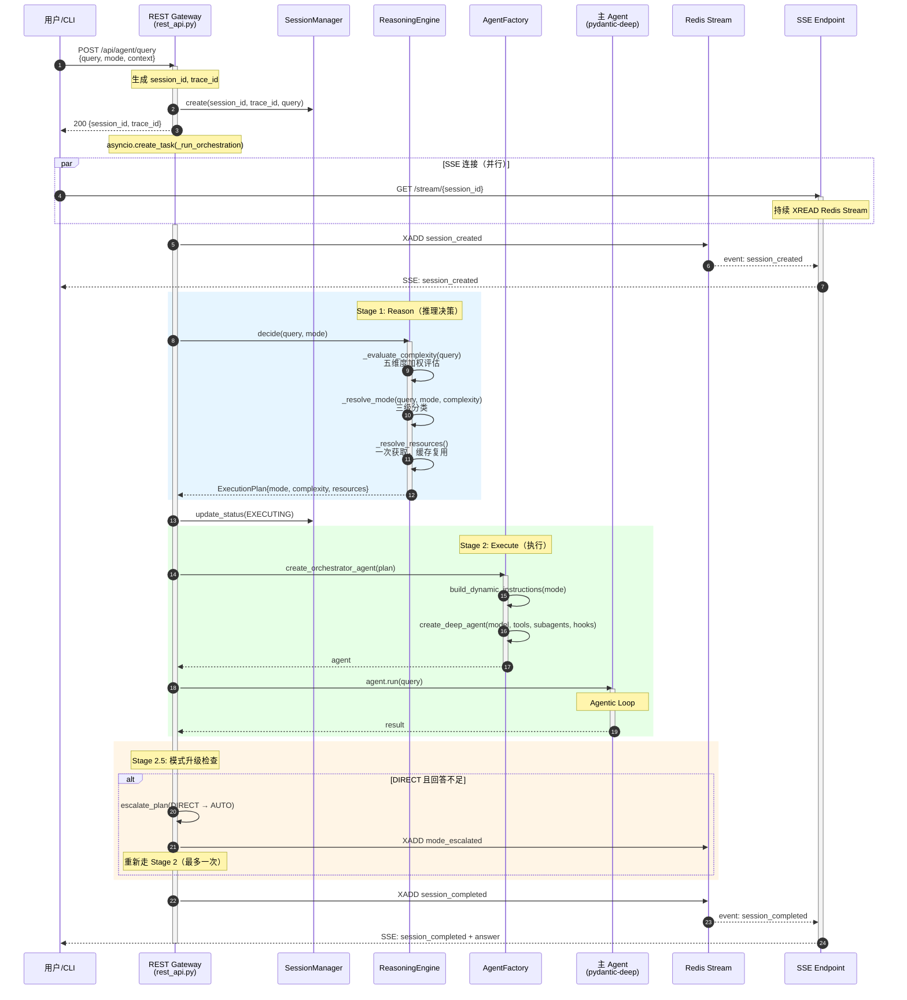
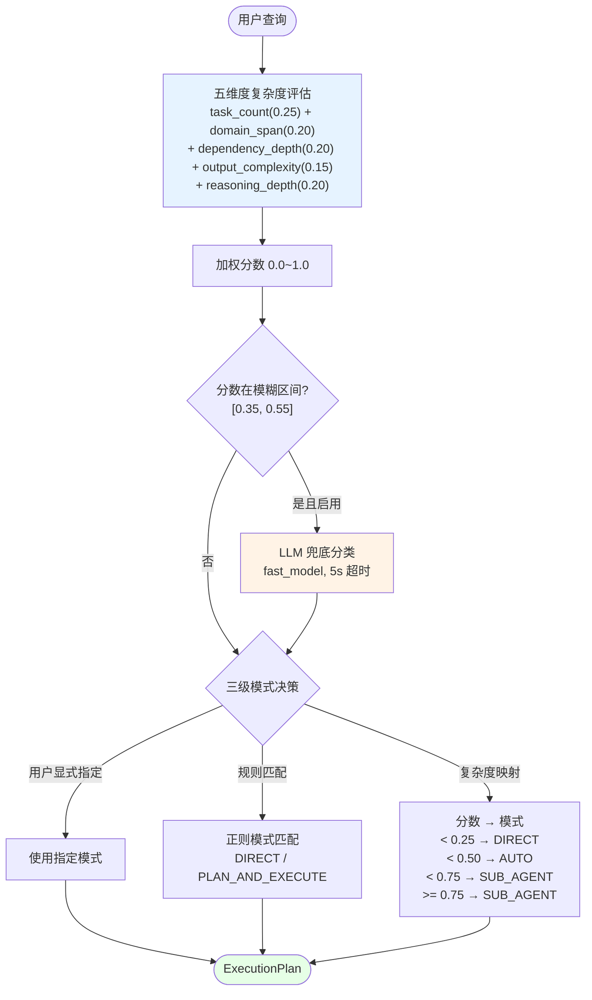
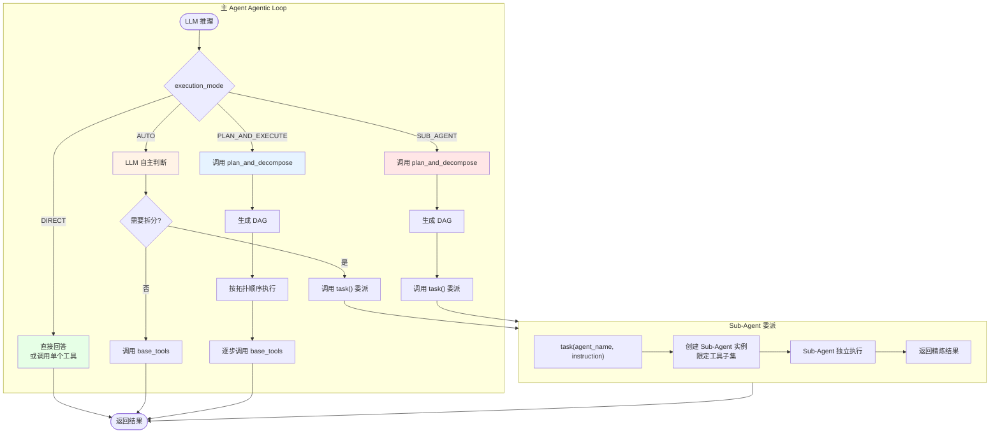
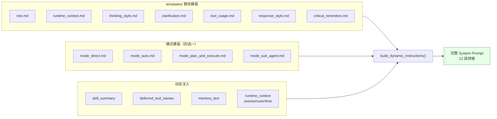
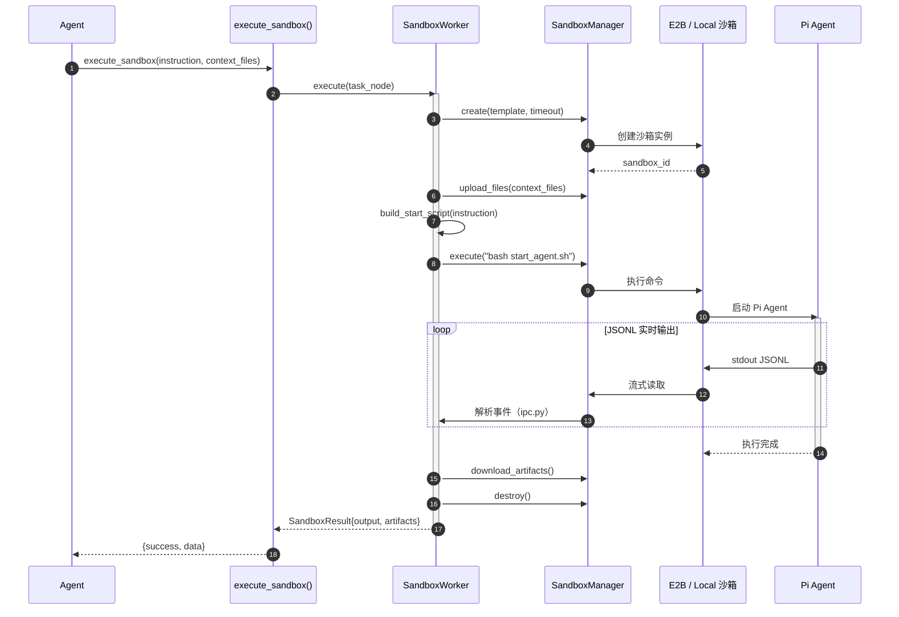
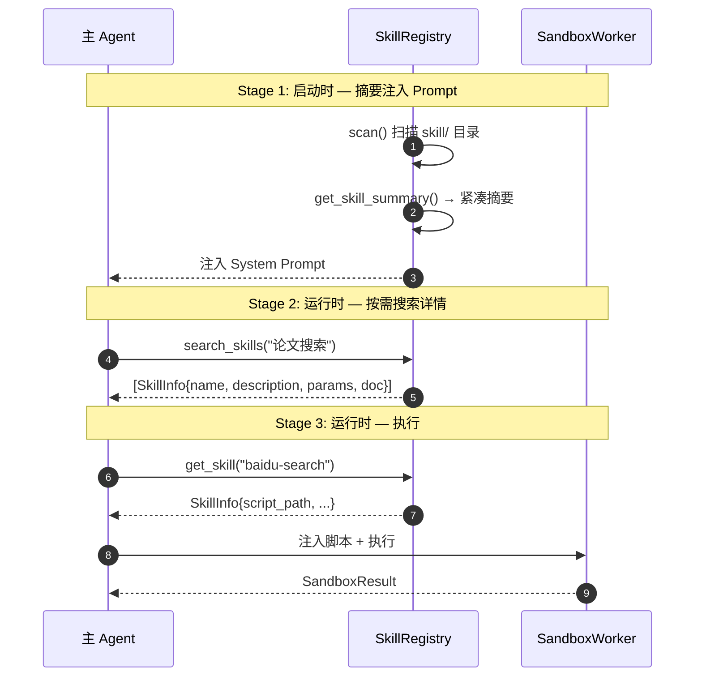
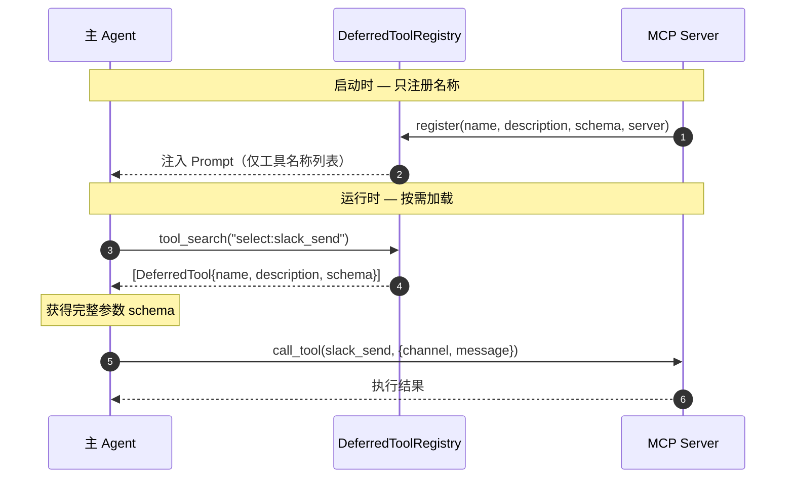
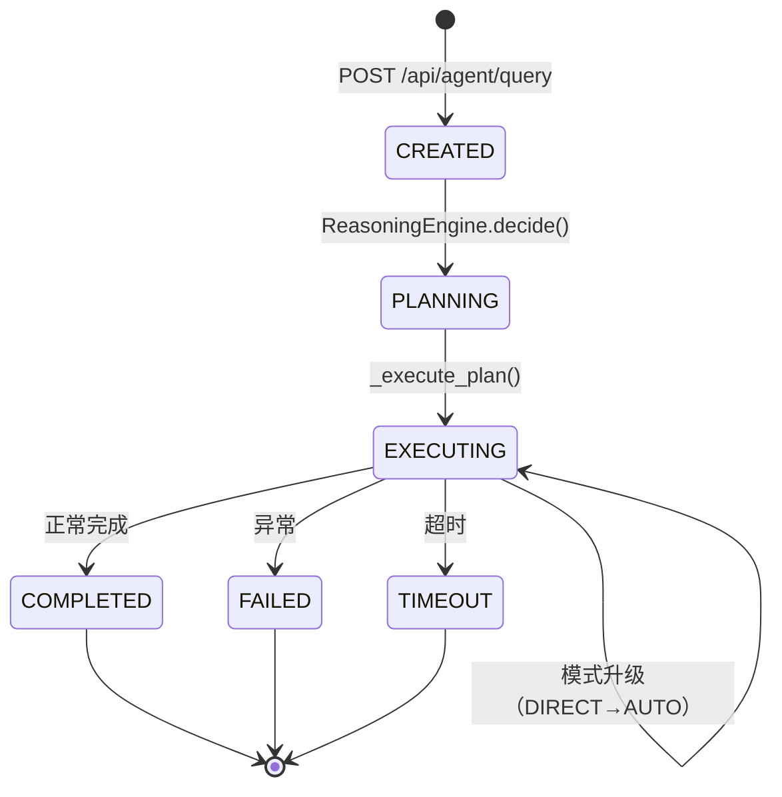

# 运行时数据流

## 1. 主流程：请求 → 响应

```mermaid
sequenceDiagram
    autonumber
    participant User as 用户/CLI
    participant GW as REST Gateway<br/>(rest_api.py)
    participant SM as SessionManager
    participant RE as ReasoningEngine
    participant AF as AgentFactory
    participant Agent as 主 Agent<br/>(pydantic-deep)
    participant Redis as Redis Stream
    participant SSE as SSE Endpoint

    User->>GW: POST /api/agent/query<br/>{query, mode, context}
    activate GW
    Note over GW: 生成 session_id, trace_id
    GW->>SM: create(session_id, trace_id, query)
    GW-->>User: 200 {session_id, trace_id}
    deactivate GW

    Note over GW: asyncio.create_task(_run_orchestration)

    par SSE 连接（并行）
        User->>SSE: GET /stream/{session_id}
        activate SSE
        Note over SSE: 持续 XREAD Redis Stream
    end

    activate GW
    GW->>Redis: XADD session_created
    Redis-->>SSE: event: session_created
    SSE-->>User: SSE: session_created

    rect rgb(230, 245, 255)
        Note over RE: Stage 1: Reason（推理决策）
        GW->>RE: decide(query, mode)
        activate RE
        RE->>RE: _evaluate_complexity(query)<br/>五维度加权评估
        RE->>RE: _resolve_mode(query, mode, complexity)<br/>三级分类
        RE->>RE: _resolve_resources()<br/>一次获取，缓存复用
        RE-->>GW: ExecutionPlan{mode, complexity, resources}
        deactivate RE
    end

    GW->>SM: update_status(EXECUTING)

    rect rgb(230, 255, 230)
        Note over AF: Stage 2: Execute（执行）
        GW->>AF: create_orchestrator_agent(plan)
        activate AF
        AF->>AF: build_dynamic_instructions(mode)
        AF->>AF: create_deep_agent(model, tools, subagents, hooks)
        AF-->>GW: agent
        deactivate AF

        GW->>Agent: agent.run(query)
        activate Agent
        Note over Agent: Agentic Loop
        Agent-->>GW: result
        deactivate Agent
    end

    rect rgb(255, 245, 230)
        Note over GW: Stage 2.5: 模式升级检查
        alt DIRECT 且回答不足
            GW->>GW: escalate_plan(DIRECT → AUTO)
            GW->>Redis: XADD mode_escalated
            Note over GW: 重新走 Stage 2（最多一次）
        end
    end

    GW->>Redis: XADD session_completed
    Redis-->>SSE: event: session_completed
    SSE-->>User: SSE: session_completed + answer
    deactivate SSE
    deactivate GW
```

## 2. ReasoningEngine 决策流程

```mermaid
flowchart TB
    Start([用户查询]) --> Complexity["五维度复杂度评估<br/>task_count(0.25) + domain_span(0.20)<br/>+ dependency_depth(0.20) + output_complexity(0.15)<br/>+ reasoning_depth(0.20)"]

    Complexity --> Score["加权分数 0.0~1.0"]
    Score --> Fuzzy{"分数在模糊区间?<br/>[0.35, 0.55]"}

    Fuzzy -->|是且启用| LLM["LLM 兜底分类<br/>fast_model, 5s 超时"]
    Fuzzy -->|否| ModeDecision
    LLM --> ModeDecision

    ModeDecision{"三级模式决策"}
    ModeDecision -->|"用户显式指定"| Explicit["使用指定模式"]
    ModeDecision -->|"规则匹配"| Rule["正则模式匹配<br/>DIRECT / PLAN_AND_EXECUTE"]
    ModeDecision -->|"复杂度映射"| Map["分数 → 模式<br/>< 0.25 → DIRECT<br/>< 0.50 → AUTO<br/>< 0.75 → SUB_AGENT<br/>>= 0.75 → SUB_AGENT"]

    Explicit --> Plan([ExecutionPlan])
    Rule --> Plan
    Map --> Plan

    style Complexity fill:#e6f3ff
    style LLM fill:#fff3e6
    style Plan fill:#e6ffe6
```

## 3. Agentic Loop 四种模式

```mermaid
flowchart TB
    subgraph AgenticLoop["主 Agent Agentic Loop"]
        Start([LLM 推理]) --> ModeCheck{execution_mode}

        ModeCheck -->|DIRECT| Direct["直接回答<br/>或调用单个工具"]

        ModeCheck -->|AUTO| Auto["LLM 自主判断"]
        Auto --> AutoDecide{需要拆分?}
        AutoDecide -->|否| AutoTool["调用 base_tools"]
        AutoDecide -->|是| AutoTask["调用 task() 委派"]

        ModeCheck -->|PLAN_AND_EXECUTE| Plan["调用 plan_and_decompose"]
        Plan --> DAG["生成 DAG"]
        DAG --> ExecDAG["按拓扑顺序执行"]
        ExecDAG --> ExecStep["逐步调用 base_tools"]

        ModeCheck -->|SUB_AGENT| SubPlan["调用 plan_and_decompose"]
        SubPlan --> SubDAG["生成 DAG"]
        SubDAG --> Delegate["调用 task() 委派"]
    end

    subgraph SubAgentFlow["Sub-Agent 委派"]
        TaskCall["task(agent_name, instruction)"]
        TaskCall --> CreateSub["创建 Sub-Agent 实例<br/>限定工具子集"]
        CreateSub --> SubRun["Sub-Agent 独立执行"]
        SubRun --> SubResult["返回精炼结果"]
    end

    Direct --> End([返回结果])
    AutoTool --> End
    AutoTask --> SubAgentFlow
    ExecStep --> End
    Delegate --> SubAgentFlow
    SubAgentFlow --> End

    style Direct fill:#e6ffe6
    style Auto fill:#fff3e6
    style Plan fill:#e6f3ff
    style SubPlan fill:#ffe6e6
```

## 4. System Prompt 组装流程

```mermaid
flowchart LR
    subgraph Templates["templates/ 静态模板"]
        R["role.md"]
        RC["runtime_context.md"]
        TS["thinking_style.md"]
        CL["clarification.md"]
        TU["tool_usage.md"]
        RS["response_style.md"]
        CR["critical_reminders.md"]
    end

    subgraph ModeTemplates["模式模板（四选一）"]
        MD["mode_direct.md"]
        MA["mode_auto.md"]
        MP["mode_plan_and_execute.md"]
        MS["mode_sub_agent.md"]
    end

    subgraph Dynamic["动态注入"]
        SK["skill_summary"]
        DT["deferred_tool_names"]
        MM["memory_text"]
        RTC["runtime_context<br/>session/user/time"]
    end

    Templates --> Assembly["build_dynamic_instructions()"]
    ModeTemplates --> Assembly
    Dynamic --> Assembly
    Assembly --> Final["完整 System Prompt<br/>12 段拼接"]

    style Final fill:#e6ffe6,stroke:#4a9d4a
```

## 5. 沙箱执行链路

```mermaid
sequenceDiagram
    autonumber
    participant Agent as Agent
    participant Bridge as execute_sandbox()
    participant SW as SandboxWorker
    participant SM as SandboxManager
    participant Sandbox as E2B / Local 沙箱
    participant Pi as Pi Agent

    Agent->>Bridge: execute_sandbox(instruction, context_files)
    Bridge->>SW: execute(task_node)
    activate SW

    SW->>SM: create(template, timeout)
    SM->>Sandbox: 创建沙箱实例
    Sandbox-->>SM: sandbox_id

    SW->>SM: upload_files(context_files)
    SW->>SW: build_start_script(instruction)

    SW->>SM: execute("bash start_agent.sh")
    SM->>Sandbox: 执行命令
    Sandbox->>Pi: 启动 Pi Agent
    activate Pi

    loop JSONL 实时输出
        Pi->>Sandbox: stdout JSONL
        Sandbox->>SM: 流式读取
        SM->>SW: 解析事件（ipc.py）
    end

    Pi-->>Sandbox: 执行完成
    deactivate Pi

    SW->>SM: download_artifacts()
    SW->>SM: destroy()

    SW-->>Bridge: SandboxResult{output, artifacts}
    deactivate SW
    Bridge-->>Agent: {success, data}
```

## 6. Skill 三阶段渐进加载

```mermaid
sequenceDiagram
    autonumber
    participant Agent as 主 Agent
    participant Registry as SkillRegistry
    participant SW as SandboxWorker

    Note over Agent,SW: Stage 1: 启动时 — 摘要注入 Prompt
    Registry->>Registry: scan() 扫描 skill/ 目录
    Registry->>Registry: get_skill_summary() → 紧凑摘要
    Registry-->>Agent: 注入 System Prompt

    Note over Agent,SW: Stage 2: 运行时 — 按需搜索详情
    Agent->>Registry: search_skills("论文搜索")
    Registry-->>Agent: [SkillInfo{name, description, params, doc}]

    Note over Agent,SW: Stage 3: 运行时 — 执行
    Agent->>Registry: get_skill("baidu-search")
    Registry-->>Agent: SkillInfo{script_path, ...}
    Agent->>SW: 注入脚本 + 执行
    SW-->>Agent: SandboxResult
```

## 7. MCP 渐进式加载

```mermaid
sequenceDiagram
    autonumber
    participant Agent as 主 Agent
    participant DTR as DeferredToolRegistry
    participant MCP as MCP Server

    Note over Agent,MCP: 启动时 — 只注册名称
    MCP->>DTR: register(name, description, schema, server)
    DTR-->>Agent: 注入 Prompt（仅工具名称列表）

    Note over Agent,MCP: 运行时 — 按需加载
    Agent->>DTR: tool_search("select:slack_send")
    DTR-->>Agent: [DeferredTool{name, description, schema}]

    Note over Agent: 获得完整参数 schema
    Agent->>MCP: call_tool(slack_send, {channel, message})
    MCP-->>Agent: 执行结果
```

## 8. 会话状态机

```mermaid
stateDiagram-v2
    [*] --> CREATED: POST /api/agent/query
    CREATED --> PLANNING: ReasoningEngine.decide()
    PLANNING --> EXECUTING: _execute_plan()
    EXECUTING --> COMPLETED: 正常完成
    EXECUTING --> FAILED: 异常
    EXECUTING --> TIMEOUT: 超时
    EXECUTING --> EXECUTING: 模式升级（DIRECT→AUTO）
    COMPLETED --> [*]
    FAILED --> [*]
    TIMEOUT --> [*]
```
