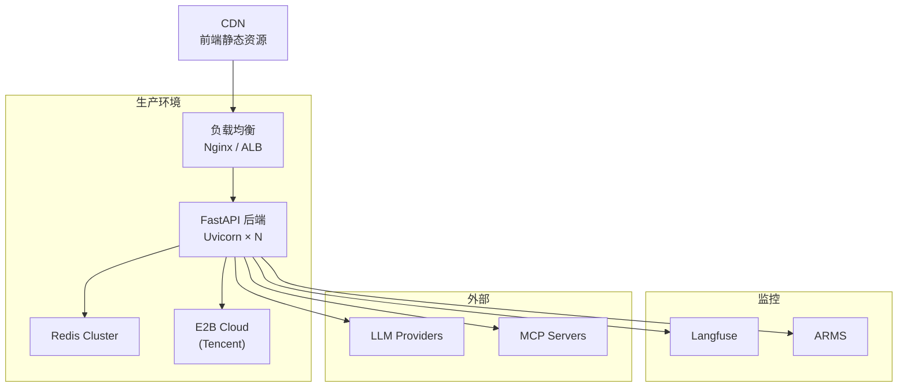

# 部署与配置指南

## 环境要求

| 依赖 | 版本 | 必需 |
|------|------|------|
| Python | 3.12+ | 是 |
| Node.js | 18+ | 是（前端） |
| Redis | 6+ | 是（降级可运行） |
| Pi Coding Agent | latest | 是（沙箱执行） |
| PostgreSQL | - | 否（DB Worker） |
| Milvus | - | 否（RAG Worker） |

## 本地开发启动

```bash
# 1. 安装 Python 依赖
pip install -r requirements.txt

# 2. 安装前端依赖
cd frontend-deepagent && npm install && cd ..

# 3. 安装 Pi Coding Agent
npm install -g @anthropic-ai/pi-coding-agent

# 4. 配置环境变量
cp .env.example .env
# 编辑 .env 填入 API Key

# 5. 启动 Redis（如果本地没有）
redis-server

# 6. 启动后端（Terminal 1）
python run_deepagent.py
# 后端运行在 http://localhost:9001

# 7. 启动前端（Terminal 2）
cd frontend-deepagent && npm run dev
# 前端运行在 http://localhost:5173
```

## 环境变量配置

### LLM 配置

| 变量 | 默认值 | 说明 |
|------|--------|------|
| `OPENAI_API_KEY` | - | LLM API Key（必填） |
| `OPENAI_API_BASE` | - | API Base URL（自定义网关时填写） |
| `PLANNING_MODEL` | `claude-4.5-sonnet` | 规划模型（高质量推理） |
| `EXECUTION_MODEL` | `gpt-4o-mini` | 执行模型（性价比优先） |
| `FAST_MODEL` | `gpt-4o-mini` | 快速模型（复杂度评估兜底） |
| `LLM_REQUEST_TIMEOUT` | `60` | LLM 请求超时（秒） |
| `ENABLE_LITELLM` | `false` | 启用 LiteLLM 多 Provider 路由 |
| `BAIDU_API_KEY` | - | 百度 AI 搜索 Key |

### Redis 配置

| 变量 | 默认值 | 说明 |
|------|--------|------|
| `REDIS_HOST` | `localhost` | Redis 地址 |
| `REDIS_PORT` | `6379` | Redis 端口 |
| `REDIS_DB` | `0` | Redis 数据库编号 |
| `REDIS_PASSWORD` | - | Redis 密码 |
| `REDIS_STREAM_MAX_LEN` | `5000` | Stream 最大事件数 |
| `REDIS_STREAM_TTL` | `3600` | Stream 过期时间（秒） |

### E2B 沙箱配置

| 变量 | 默认值 | 说明 |
|------|--------|------|
| `E2B_API_KEY` | - | E2B API Key |
| `E2B_TIMEOUT` | `300` | 沙箱执行超时（秒） |
| `E2B_USE_LOCAL` | `true` | 使用本地子进程（开发模式） |
| `SANDBOX_PI_PROVIDER` | `my-gateway` | Pi Agent 使用的 LLM Provider |
| `SANDBOX_PI_MODEL` | `gpt-4o` | Pi Agent 使用的模型 |

### Langfuse 监控配置

| 变量 | 默认值 | 说明 |
|------|--------|------|
| `LANGFUSE_PUBLIC_KEY` | - | Langfuse Public Key |
| `LANGFUSE_SECRET_KEY` | - | Langfuse Secret Key |
| `LANGFUSE_HOST` | `https://cloud.langfuse.com` | Langfuse 服务地址 |
| `LANGFUSE_ENABLED` | `false` | 启用 Langfuse 追踪 |

### MCP 配置

| 变量 | 默认值 | 说明 |
|------|--------|------|
| `MCP_SERVERS` | - | MCP 服务端点 JSON 数组 |
| `MCP_SERVER_URL` | - | 单 MCP 服务 URL（备选） |
| `MCP_CONNECT_TIMEOUT` | `10.0` | MCP 连接超时（秒） |

### 记忆系统配置

| 变量 | 默认值 | 说明 |
|------|--------|------|
| `MEMORY_ENABLED` | `true` | 启用记忆系统 |
| `MEMORY_RETRIEVAL_TIMEOUT_MS` | `200` | 记忆检索超时（毫秒） |
| `MEMORY_MAX_FACTS` | `100` | 最大 Fact 数量 |
| `MEMORY_LOCK_TTL` | `30` | 分布式锁 TTL（秒） |
| `MEMORY_CONVERSATION_MAX_TURNS` | `20` | 对话历史最大轮数 |
| `MEMORY_CONVERSATION_TTL` | `3600` | 对话历史过期时间（秒） |

### 推理引擎配置

| 变量 | 默认值 | 说明 |
|------|--------|------|
| `REASONING_FUZZY_ZONE_LOW` | `0.35` | 模糊区间下界 |
| `REASONING_FUZZY_ZONE_HIGH` | `0.55` | 模糊区间上界 |
| `REASONING_LLM_CLASSIFY_ENABLED` | `true` | 启用 LLM 兜底分类 |
| `REASONING_LLM_CLASSIFY_TIMEOUT` | `5.0` | LLM 分类超时（秒） |
| `REASONING_ESCALATION_ENABLED` | `false` | 启用模式升级（DIRECT→AUTO） |

### 应用配置

| 变量 | 默认值 | 说明 |
|------|--------|------|
| `APP_NAME` | `super-agent` | 应用名称 |
| `APP_HOST` | `0.0.0.0` | 监听地址 |
| `APP_PORT` | `8000` | 监听端口 |
| `DEBUG` | `false` | 调试模式（热重载） |
| `SKILL_DIR` | `skill` | 技能目录路径 |
| `JWT_SECRET` | `super-agent-secret` | JWT 签名密钥 |
| `MAX_CONCURRENT_SUBAGENTS` | `3` | 最大并发 Sub-Agent 数 |

## 部署架构



## 依赖服务清单

| 服务 | 用途 | 缺失时的影响 |
|------|------|-------------|
| Redis | 会话/事件流/记忆 | SSE 推送不可用，降级为同步返回 |
| LLM Provider | 推理决策 | 核心功能不可用 |
| E2B / Local Sandbox | 代码执行 | Sandbox 相关工具不可用 |
| Langfuse | 调用追踪 | 无监控数据，不影响功能 |
| Milvus | 向量检索 | RAG 工具不可用 |
| PostgreSQL | 数据查询 | DB Query 工具不可用 |
| MCP Server | 外部工具 | MCP 工具不可用 |
