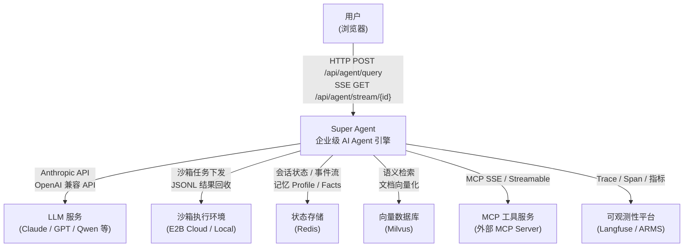
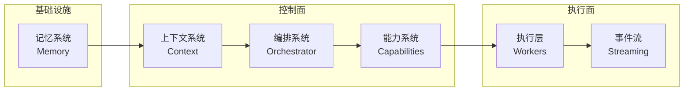

# C4 Level 1：系统上下文

## 系统定位

Super Agent 是一个企业级混合 AI Agent 引擎：Python 控制面负责宏观编排与推理决策，沙箱 Pi Agent 负责微观代码执行与工具调用，通过 SSE 事件流向前端实时推送结构化 A2UI 组件。

## 系统上下文图

## 架构全景：六大支柱

| 支柱 | 职责 | 对应模块 |
|------|------|---------|
| 上下文系统 | 组装 System Prompt（12 段模板），决定 Agent "知道什么" | `context/builder.py` |
| 编排系统 | 五维度复杂度评估 → 四种执行模式路由，创建主 Agent | `orchestrator/` |
| 能力系统 | 10 内置工具 + Skills 三阶段加载 + MCP 延迟加载 | `capabilities/` |
| 执行层 | 沙箱 Pi Agent 执行 + 原生 Worker（WebSearch 等） | `workers/` |
| 事件流 | Redis Stream → SSE，断点续传，A2UI 事件协议 | `streaming/` |
| 记忆系统 | Redis 持久化 UserProfile + Facts，200ms 超时降级 | `memory/` |

## 外部系统说明

| 外部系统 | 角色 | 当前实现 | 是否必需 |
|---------|------|---------|---------|
| LLM 服务 | 推理大脑 | Anthropic 原生 + OpenAI 兼容（通过 models.yaml 路由） | 必需 |
| Redis | 状态存储 + 事件总线 | redis-py，Streams + Hash | 必需 |
| E2B / Local 沙箱 | 代码隔离执行 | E2B_USE_LOCAL=true 走本地进程 | 可选（无沙箱任务时） |
| Milvus | 向量检索 | pymilvus，接口预留 | 可选 |
| MCP Server | 外部工具扩展 | SSE / Streamable 协议，延迟加载 | 可选 |
| Langfuse | LLM 追踪 | langfuse SDK，LANGFUSE_ENABLED=false 可关闭 | 可选 |
| ARMS | 阿里云 APM | arms_tracer，生产环境使用 | 可选 |

## 核心价值主张

- 混合执行：控制面 Python 编排 + 沙箱微观执行，安全隔离与灵活性兼顾
- 多模型路由：同一套代码支持 Claude / GPT / Qwen / DeepSeek / Gemini，通过 YAML 配置切换
- 实时可观测：所有执行步骤通过 SSE 实时推送，前端 A2UI 动态渲染结构化结果
- 渐进式能力加载：工具摘要→详情→执行，避免 Prompt 膨胀