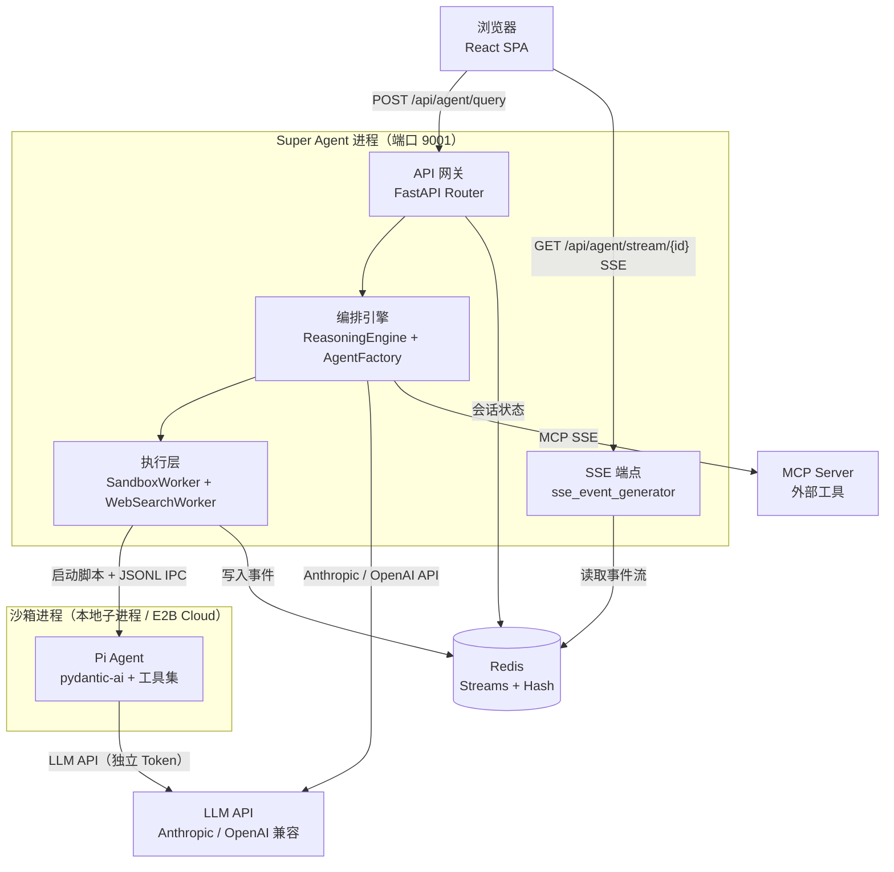

# C4 Level 2：容器视图

## 容器架构图

## 各容器说明

| 容器 | 语言/框架 | 端口 | 入口 | 职责 |
|------|---------|------|------|------|
| Super Agent 后端 | Python 3.12 + FastAPI + uvicorn | 9001 | `run_deepagent.py` | 编排、路由、状态管理、事件推送 |
| React 前端 | TypeScript + React 18 + Vite | 5173（dev） | `frontend-deepagent/src/main.tsx` | A2UI 动态渲染、SSE 消费、用户交互 |
| 沙箱进程 | Python（Pi Agent） | N/A（IPC） | 由 SandboxWorker 动态启动 | 隔离代码执行、工具调用 |
| Redis | Redis 7+ | 6379 | — | 会话状态、事件流（Streams）、记忆存储 |
| LLM API | — | 443 | — | 推理服务（Anthropic / OpenAI 兼容网关） |

## 通信协议

| 路径 | 协议 | 说明 |
|------|------|------|
| 浏览器 → 后端（查询） | HTTP POST + JSON | `POST /api/agent/query`，同步返回 session_id |
| 浏览器 → 后端（事件） | SSE（HTTP GET） | `GET /api/agent/stream/{session_id}`，支持 Last-Event-ID 断点续传 |
| 浏览器 → 后端（WebSocket） | WebSocket | 备用双向通道，`websocket_api.py` |
| 后端 → LLM | HTTPS + JSON | Anthropic 原生 SDK 或 OpenAI 兼容 HTTP |
| 后端 → 沙箱 | 本地子进程 JSONL | 标准输入/输出，JSONL 格式事件 |
| 后端 → Redis | TCP（redis-py） | Streams（XADD/XREAD）+ Hash（HSET/HGET） |
| 后端 → MCP | HTTP SSE / Streamable | MCP 协议，延迟建立连接 |

## 技术栈总览

| 层次 | 技术 | 版本 |
|------|------|------|
| Web 框架 | FastAPI + uvicorn | 0.115 / 0.34 |
| Agent 框架 | pydantic-ai + pydantic-deep | 1.84.1 / 0.3.3 |
| LLM 多提供商 | anthropic + litellm + openai | 0.96 / 1.55 / 2.29 |
| 状态存储 | redis[hiredis] | 5.2 |
| 沙箱 | e2b + e2b-code-interpreter | 1.2 / 1.1 |
| 向量数据库 | pymilvus | 2.5 |
| 工作流引擎 | temporalio | 1.9（预留） |
| MCP | mcp + fastmcp | 1.26 / 3.2 |
| 可观测性 | langfuse + logfire | 4.0 / 4.29 |
| 前端框架 | React + TypeScript + Vite | 18.3 / 5.6 / 6.0 |
| 前端可视化 | echarts + xterm | 5.5 / 5.5 |
