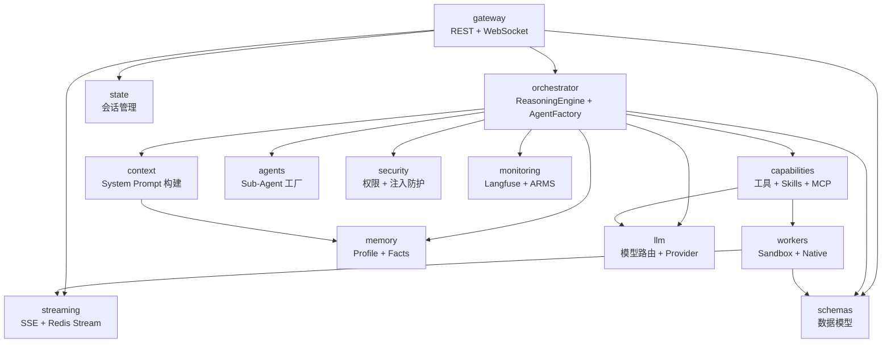

# C4 Level 3：组件视图

## 模块依赖关系图



---

## 支柱一：上下文系统

### context/builder.py

| 项目 | 说明 |
|------|------|
| 职责 | 组装 System Prompt，12 段模板按需拼接 |
| 关键类 | `ContextBuilder` |
| 核心方法 | `build_dynamic_instructions(session_id, user_id, mode, resources)` |
| 依赖 | `memory/`（注入用户记忆）、`capabilities/`（注入工具摘要） |

---

## 支柱二：编排系统

### orchestrator/reasoning_engine.py

| 项目 | 说明 |
|------|------|
| 职责 | 五维度复杂度评估，决定执行模式；聚合所有运行时资源 |
| 关键类 | `ReasoningEngine`, `ExecutionPlan`, `ResolvedResources` |
| 执行模式 | `DIRECT` / `AUTO` / `PLAN_AND_EXECUTE` / `SUB_AGENT` |
| 核心方法 | `async get_plan(query, session_id) → ExecutionPlan` |
| 依赖 | `llm/`（分类模型）、`capabilities/`（MCP 预热）、`workers/` |

关键文件：

| 文件 | 职责 |
|------|------|
| `reasoning_engine.py` | 资源获取 + 模式决策 |
| `agent_factory.py` | 创建主 Agent（pydantic-ai Agent 实例） |
| `hooks.py` | 循环检测（滑动窗口 MD5）+ 审计日志 |
| `planning.py` | DAG 规划 Prompt 模板 |

### orchestrator/agent_factory.py

| 项目 | 说明 |
|------|------|
| 职责 | 根据 ExecutionPlan 创建配置好的主 Agent |
| 核心函数 | `create_orchestrator_agent(plan, sub_agent_configs, session_id, trace_id, publish_fn)` |
| 输出 | `(agent: Agent, deps: AgentDeps)` |

---

## 支柱三：能力系统

### capabilities/base_tools.py

工具按职责分组：

| 分组 | 工具 | 说明 |
|------|------|------|
| `native` | `execute_web_search` | 网络搜索 |
| `sandbox` | `execute_sandbox`, `execute_skill` | 沙箱执行、Skill 调用 |
| `ui` | `render_widget` | 渲染 A2UI 组件 |
| `memory` | `save_memory`, `retrieve_memory` | 记忆读写 |
| `plan` | `plan_and_decompose` | 任务规划分解 |
| `skill_mgmt` | `list_skills`, `create_skill` | Skill 管理 |

### capabilities/registry.py

| 项目 | 说明 |
|------|------|
| 职责 | 统一注册和分发工具、Skill、MCP Toolset |
| 关键类 | `CapabilityRegistry` |
| 加载策略 | 渐进式：摘要 → 详情 → 执行，避免全量注入 Prompt |

### capabilities/mcp/client_manager.py

| 项目 | 说明 |
|------|------|
| 职责 | 管理多个 MCP 端点的连接生命周期 |
| 关键类 | `MCPClientManager`, `MCPEndpointConfig` |
| 连接策略 | 延迟建立，定期刷新（`refresh_interval=300s`） |
| 传输协议 | SSE / Streamable（自动检测） |

### capabilities/skills/

| 文件 | 职责 |
|------|------|
| `registry.py` | 自动扫描 `skill/` 目录，注册 Skill 元数据 |
| `schema.py` | `SkillMeta`：name / description / script_name / execution_mode |

---

## 支柱四：执行层

### workers/base.py

```
BaseWorker
├── name: str (property)
├── execute(task: TaskNode) → WorkerResult   # 模板方法（日志+追踪+异常）
└── _do_execute(task: TaskNode) → WorkerResult  # 子类实现
```

### workers/sandbox/

| 文件 | 职责 |
|------|------|
| `sandbox_worker.py` | 编排沙箱任务：注入上下文 → 启动 Pi Agent → 解析 JSONL 输出 |
| `sandbox_manager.py` | 沙箱生命周期：创建 / 复用 / 销毁（E2B 或本地进程） |
| `pi_agent_config.py` | 生成 Pi Agent 启动脚本（注入 LLM Token、工具配置） |
| `ipc.py` | JSONL 流解析：artifacts + final_answer + 事件 |

### workers/native/

| 文件 | 职责 |
|------|------|
| `web_search_worker.py` | 网络搜索，返回结构化结果 |

---

## 支柱五：事件流

### streaming/

| 文件 | 职责 |
|------|------|
| `sse_endpoint.py` | SSE 事件生成器，支持 Last-Event-ID 断点续传 |
| `stream_adapter.py` | Redis Streams 读写适配（XADD / XREAD） |
| `protocol.py` | 事件类型定义：thinking / step / tool_call / tool_result / text_stream / render_widget / session_completed / session_failed / heartbeat |
| `recovery.py` | 断点续传：从指定 event_id 恢复读取 |

---

## 支柱六：记忆系统

### memory/

| 文件 | 职责 |
|------|------|
| `storage.py` | `MemoryStorage` ABC + `RedisMemoryStorage` 实现 |
| `schema.py` | `UserProfile`, `Fact`, `MemoryData` |
| `retriever.py` | 按 user_id + query 检索记忆，200ms 超时降级 |
| `updater.py` | 写入 / 更新 Profile 和 Facts |

---

## 辅助模块

### llm/

| 文件 | 职责 |
|------|------|
| `catalog.py` | 加载 `models.yaml`，解析 providers + models + roles |
| `registry.py` | `get_model_bundle(role, mode)` 门面函数 |
| `providers/anthropic_native.py` | Anthropic 原生适配，支持 `anthropic_thinking` 推理格式 |
| `providers/openai_compat.py` | OpenAI 兼容适配，支持 `reasoning_content` / `inline_thinking_tags` |
| `compatibility.py` | 推理格式兼容性处理（跨模型统一输出） |
| `token_manager.py` | 为沙箱 Pi Agent 签发短期 LLM Token |

### state/session_manager.py

| 项目 | 说明 |
|------|------|
| 职责 | 会话生命周期管理，Redis Hash 持久化 |
| 状态机 | PENDING → RUNNING → COMPLETED / FAILED |
| TTL | `conversation_ttl=3600s` |

### agents/

| 文件 | 职责 |
|------|------|
| `factory.py` | `create_sub_agent_configs()` 合并预置 + 自定义角色 |
| `roles.py` | 预置角色：Researcher / Analyst / Writer |
| `custom/registry.py` | 自定义 Agent 注册表（运行时动态注册） |
