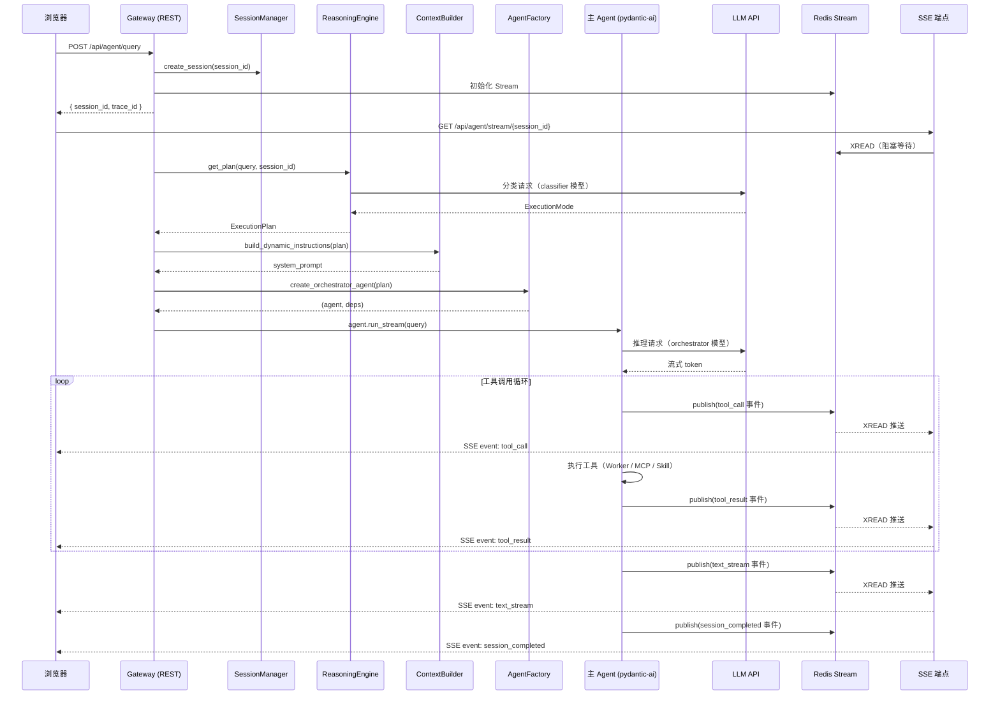
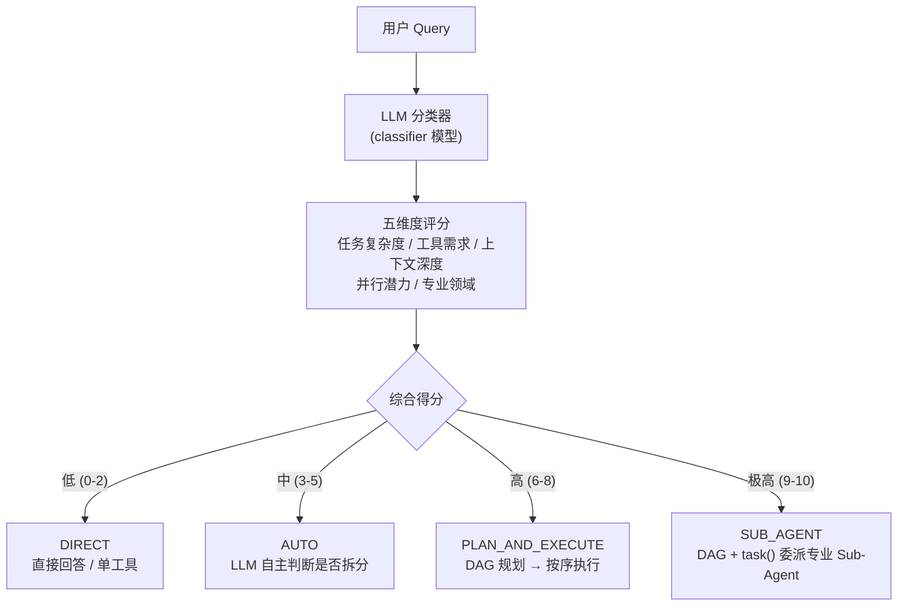
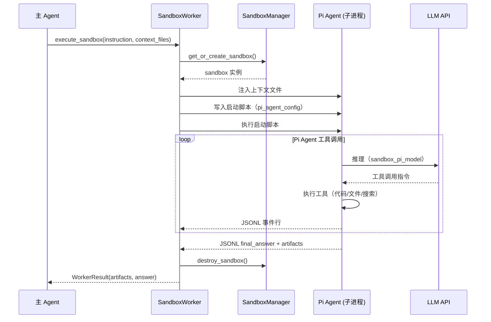
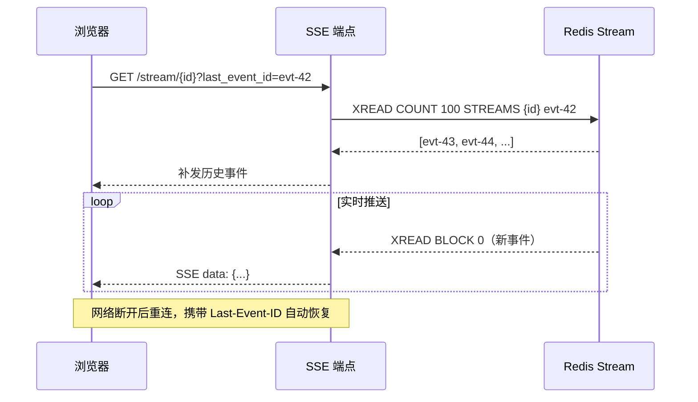
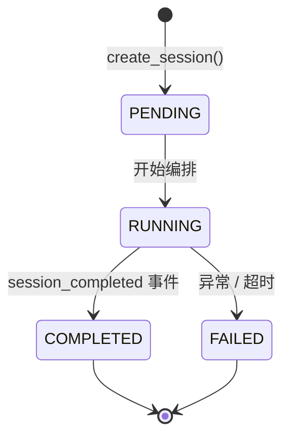
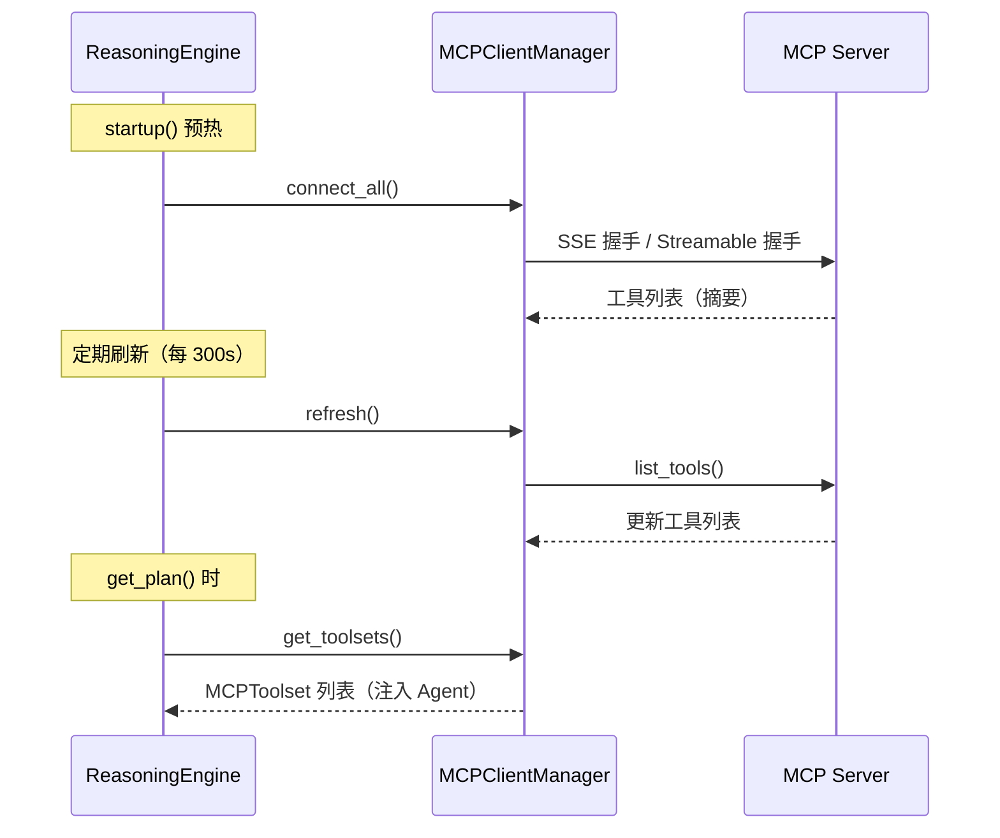

# 运行时数据流

## 主流程：用户请求到响应

```mermaid
sequenceDiagram
    participant U as 浏览器
    participant GW as Gateway (REST)
    participant SM as SessionManager
    participant RE as ReasoningEngine
    participant CTX as ContextBuilder
    participant AF as AgentFactory
    participant AG as 主 Agent (pydantic-ai)
    participant LLM as LLM API
    participant SA as Redis Stream
    participant SSE as SSE 端点

    U->>GW: POST /api/agent/query
    GW->>SM: create_session(session_id)
    GW->>SA: 初始化 Stream
    GW-->>U: { session_id, trace_id }

    U->>SSE: GET /api/agent/stream/{session_id}
    SSE->>SA: XREAD（阻塞等待）

    GW->>RE: get_plan(query, session_id)
    RE->>LLM: 分类请求（classifier 模型）
    LLM-->>RE: ExecutionMode
    RE-->>GW: ExecutionPlan

    GW->>CTX: build_dynamic_instructions(plan)
    CTX-->>GW: system_prompt

    GW->>AF: create_orchestrator_agent(plan)
    AF-->>GW: (agent, deps)

    GW->>AG: agent.run_stream(query)
    AG->>LLM: 推理请求（orchestrator 模型）
    LLM-->>AG: 流式 token

    loop 工具调用循环
        AG->>SA: publish(tool_call 事件)
        SA-->>SSE: XREAD 推送
        SSE-->>U: SSE event: tool_call
        AG->>AG: 执行工具（Worker / MCP / Skill）
        AG->>SA: publish(tool_result 事件)
        SA-->>SSE: XREAD 推送
        SSE-->>U: SSE event: tool_result
    end

    AG->>SA: publish(text_stream 事件)
    SA-->>SSE: XREAD 推送
    SSE-->>U: SSE event: text_stream

    AG->>SA: publish(session_completed 事件)
    SSE-->>U: SSE event: session_completed
```

---

## 执行模式决策流程

```mermaid
flowchart TD
    Q["用户 Query"] --> CLS["LLM 分类器\n(classifier 模型)"]
    CLS --> SCORE["五维度评分\n任务复杂度 / 工具需求 / 上下文深度\n并行潜力 / 专业领域"]
    SCORE --> D{综合得分}
    D -->|"低 (0-2)"| DIRECT["DIRECT\n直接回答 / 单工具"]
    D -->|"中 (3-5)"| AUTO["AUTO\nLLM 自主判断是否拆分"]
    D -->|"高 (6-8)"| PLAN["PLAN_AND_EXECUTE\nDAG 规划 → 按序执行"]
    D -->|"极高 (9-10)"| SUB["SUB_AGENT\nDAG + task() 委派专业 Sub-Agent"]
```

---

## 沙箱执行子流程

```mermaid
sequenceDiagram
    participant AG as 主 Agent
    participant SW as SandboxWorker
    participant SM as SandboxManager
    participant PA as Pi Agent (子进程)
    participant LLM as LLM API

    AG->>SW: execute_sandbox(instruction, context_files)
    SW->>SM: get_or_create_sandbox()
    SM-->>SW: sandbox 实例

    SW->>PA: 注入上下文文件
    SW->>PA: 写入启动脚本（pi_agent_config）
    SW->>PA: 执行启动脚本

    loop Pi Agent 工具调用
        PA->>LLM: 推理（sandbox_pi_model）
        LLM-->>PA: 工具调用指令
        PA->>PA: 执行工具（代码/文件/搜索）
        PA-->>SW: JSONL 事件行
    end

    PA-->>SW: JSONL final_answer + artifacts
    SW->>SM: destroy_sandbox()
    SW-->>AG: WorkerResult(artifacts, answer)
```

---

## SSE 断点续传流程

```mermaid
sequenceDiagram
    participant U as 浏览器
    participant SSE as SSE 端点
    participant RS as Redis Stream

    U->>SSE: GET /stream/{id}?last_event_id=evt-42
    SSE->>RS: XREAD COUNT 100 STREAMS {id} evt-42
    RS-->>SSE: [evt-43, evt-44, ...]
    SSE-->>U: 补发历史事件

    loop 实时推送
        RS-->>SSE: XREAD BLOCK 0（新事件）
        SSE-->>U: SSE data: {...}
    end

    Note over U,SSE: 网络断开后重连，携带 Last-Event-ID 自动恢复
```

---

## 会话状态机

```mermaid
stateDiagram-v2
    [*] --> PENDING: create_session()
    PENDING --> RUNNING: 开始编排
    RUNNING --> COMPLETED: session_completed 事件
    RUNNING --> FAILED: 异常 / 超时
    COMPLETED --> [*]
    FAILED --> [*]
```

---

## MCP 工具加载流程

```mermaid
sequenceDiagram
    participant RE as ReasoningEngine
    participant MCM as MCPClientManager
    participant MCP as MCP Server

    Note over RE: startup() 预热
    RE->>MCM: connect_all()
    MCM->>MCP: SSE 握手 / Streamable 握手
    MCP-->>MCM: 工具列表（摘要）

    Note over RE: 定期刷新（每 300s）
    RE->>MCM: refresh()
    MCM->>MCP: list_tools()
    MCP-->>MCM: 更新工具列表

    Note over RE: get_plan() 时
    RE->>MCM: get_toolsets()
    MCM-->>RE: MCPToolset 列表（注入 Agent）
```
