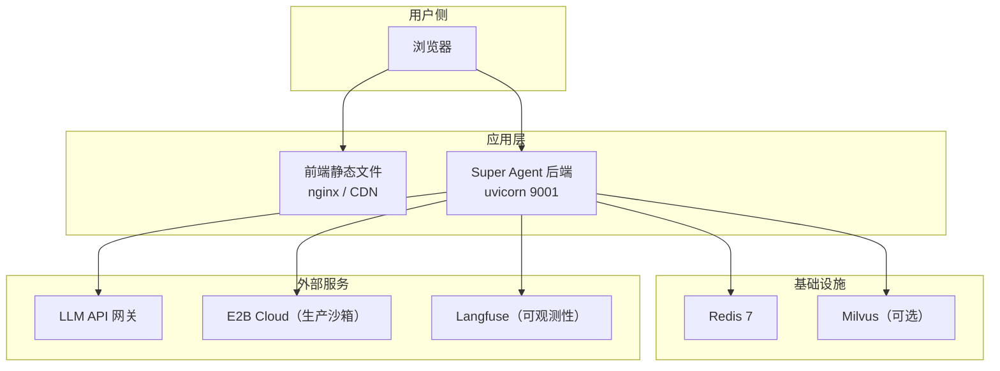

# 部署与配置指南

## 环境要求

| 依赖 | 版本 | 说明 |
|------|------|------|
| Python | 3.12+ | 后端运行时 |
| Node.js | 18+ | 前端构建 |
| Redis | 7+ | 状态存储 + 事件流 |
| Poetry | 1.8+ | Python 依赖管理 |

---

## 本地开发启动

### 1. 安装依赖

```bash
# 后端
poetry install

# 前端
cd frontend-deepagent && npm install
```

### 2. 配置环境变量

```bash
cp .env.example .env
# 编辑 .env，至少填写 OPENAI_API_KEY 和 OPENAI_API_BASE
```

### 3. 启动 Redis

```bash
redis-server
```

### 4. 启动后端

```bash
python run_deepagent.py
# 服务启动在 http://localhost:9001
```

### 5. 启动前端

```bash
cd frontend-deepagent
npm run dev
# 前端启动在 http://localhost:5173
```

---

## 环境变量配置

### LLM 配置

| 变量 | 默认值 | 说明 |
|------|--------|------|
| `OPENAI_API_KEY` | — | LLM API Key（Anthropic 和 OpenAI 兼容均使用） |
| `OPENAI_API_BASE` | — | LLM API Base URL（网关地址） |
| `LLM_CONFIG_PATH` | `src_deepagent/llm/models.yaml` | 模型配置文件路径 |
| `LLM_ORCHESTRATOR_MODEL` | `claude-4.5-sonnet` | 主编排模型 |
| `LLM_SUBAGENT_MODEL` | `gpt-4o-mini` | Sub-Agent 模型 |
| `LLM_CLASSIFIER_MODEL` | `gpt-4o-mini` | 分类器模型 |
| `LLM_TRUE_STREAMING_ENABLED` | `false` | 是否启用真流式（token 级） |
| `LLM_STREAM_THINKING_ENABLED` | `true` | 是否推送 thinking 事件 |
| `LLM_REQUEST_TIMEOUT` | `60` | LLM 请求超时（秒） |

### Redis 配置

| 变量 | 默认值 | 说明 |
|------|--------|------|
| `REDIS_HOST` | `localhost` | Redis 主机 |
| `REDIS_PORT` | `6379` | Redis 端口 |
| `REDIS_DB` | `0` | Redis 数据库编号 |
| `REDIS_PASSWORD` | — | Redis 密码（可选） |
| `REDIS_STREAM_MAX_LEN` | `5000` | Stream 最大事件数 |
| `REDIS_STREAM_TTL` | `3600` | Stream TTL（秒） |

### 沙箱配置

| 变量 | 默认值 | 说明 |
|------|--------|------|
| `E2B_API_KEY` | — | E2B Cloud API Key |
| `E2B_USE_LOCAL` | `true` | `true`=本地子进程，`false`=E2B Cloud |
| `E2B_TIMEOUT` | `300` | 沙箱超时（秒） |
| `E2B_SANDBOX_PI_PROVIDER` | `my-gateway` | Pi Agent 使用的 LLM 提供商 |
| `E2B_SANDBOX_PI_MODEL` | `gpt-4o` | Pi Agent 使用的模型 |

### 记忆配置

| 变量 | 默认值 | 说明 |
|------|--------|------|
| `MEMORY_ENABLED` | `true` | 是否启用记忆系统 |
| `MEMORY_RETRIEVAL_TIMEOUT_MS` | `200` | 记忆检索超时（毫秒），超时静默降级 |
| `MEMORY_MAX_FACTS` | `100` | 每用户最大 Facts 数 |
| `MEMORY_CONVERSATION_TTL` | `3600` | 会话记忆 TTL（秒） |

### MCP 配置

| 变量 | 默认值 | 说明 |
|------|--------|------|
| `MCP_SERVERS_JSON` | — | MCP 服务器列表（JSON 数组），优先级高于单端点 |
| `MCP_SERVER_URL` | — | 单 MCP 端点 URL（fallback） |
| `MCP_CONNECT_TIMEOUT` | `10.0` | MCP 连接超时（秒） |
| `MCP_REFRESH_INTERVAL` | `300` | MCP 工具列表刷新间隔（秒） |

### 可观测性配置

| 变量 | 默认值 | 说明 |
|------|--------|------|
| `LANGFUSE_ENABLED` | `false` | 是否启用 Langfuse 追踪 |
| `LANGFUSE_PUBLIC_KEY` | — | Langfuse 公钥 |
| `LANGFUSE_SECRET_KEY` | — | Langfuse 私钥 |
| `LANGFUSE_HOST` | `https://cloud.langfuse.com` | Langfuse 服务地址 |

### 应用配置

| 变量 | 默认值 | 说明 |
|------|--------|------|
| `APP_DEBUG` | `false` | 调试模式 |
| `APP_HOST` | `0.0.0.0` | 监听地址 |
| `APP_PORT` | `8000` | 监听端口（run_deepagent.py 覆盖为 9001） |
| `APP_SKILL_DIR` | `skill` | Skill 插件目录 |
| `APP_JWT_SECRET` | `super-agent-secret` | JWT 签名密钥（生产环境必须修改） |
| `APP_MAX_CONCURRENT_SUBAGENTS` | `3` | 最大并发 Sub-Agent 数 |

---

## 部署架构图



---

## 依赖服务清单

| 服务 | 用途 | 缺失时影响 |
|------|------|-----------|
| Redis | 会话状态、事件流、记忆存储 | 服务无法启动 |
| LLM API | 推理核心 | 服务无法处理请求 |
| E2B / 本地沙箱 | 代码执行 | `execute_sandbox` 工具不可用 |
| Milvus | 向量检索 | RAG 功能不可用（接口预留，非阻塞） |
| MCP Server | 外部工具扩展 | MCP 工具不可用，其他功能正常 |
| Langfuse | LLM 追踪 | 无追踪数据，功能不受影响 |
