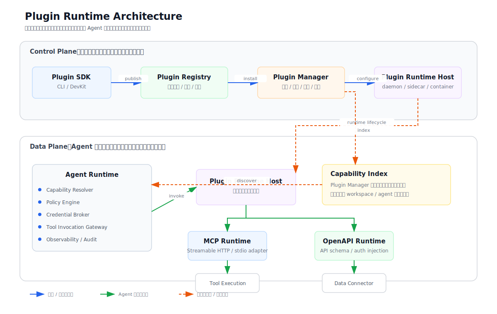

# 03. Plugin Runtime 架构

## 目标

本文件定义 Plugin 从开发、发布、安装到 Agent 调用执行的运行时架构。

核心目标：

- 插件运行与 Agent 主进程解耦。
- 管理面和调用面分离。
- 支持插件生命周期管理、运行隔离、权限控制和观测审计。
- 支持 MCP、OpenAPI、Data Source 等多种能力运行方式。

## 架构图



## 端到端流程图

架构图展示组件关系，端到端泳道图展示插件从开发、发布、安装、启用，到业务 Agent 发现并调用插件能力的完整流程。

详见：[Plugin 端到端流程说明](./plugin-end-to-end-flow.md)。


注意：泳道图表达的是职责边界，不是强制部署边界。业务 Agent 系统通常已由各业务团队建设，后续对接 Plugin 平台；Plugin 平台第一版建议由你们侧部署 Plugin 核心服务、Plugin 管理平台和 Plugin Runtime Host；外部 MCP/API/数据源通常复用现有系统，观测监控可以接入现有 Langfuse。

## 管理面与调用面

Plugin 系统需要区分 **管理面 Control Plane** 和 **调用面 Data Plane**。

管理面：

```text
Plugin SDK / CLI
  ↓ package / publish
Plugin Registry
  ↓ install / upgrade
Plugin Manager
  ↓ start / stop / configure
Plugin Runtime Host
```

管理面负责：

- 插件创建、校验、打包、发布。
- 插件存储、搜索、版本和审核。
- 插件安装、启用、禁用、升级、卸载。
- 插件配置、凭据绑定、workspace/agent 绑定。
- 插件运行宿主的启动、停止和配置。

调用面：

```text
Agent Runtime
  ↓
Capability Resolver
  ↓
Policy Engine
  ↓
Credential Broker
  ↓
Tool Invocation Gateway
  ↓
Plugin Runtime Host
  ↓
MCP Runtime / OpenAPI Runtime / Data Connector
```

调用面负责：

- 根据用户请求发现可用能力。
- 检查用户、租户、workspace、agent 权限。
- 在调用时注入必要凭据。
- 统一调用 MCP、OpenAPI、native tools、data sources。
- 标准化插件返回结果。
- 记录日志、trace、审计和错误。

`Plugin Manager` 不在每次 Agent 工具调用的主链路上。它负责把插件安装状态、启用状态、能力定义和绑定关系写入能力索引；Agent 调用时由 `Capability Resolver` 使用这些信息找到可用能力。

## 核心组件

| 组件 | 职责 |
| --- | --- |
| Plugin SDK / CLI | 创建模板、本地调试、manifest 校验、打包、发布 |
| Plugin Registry | 插件存储、搜索、版本、签名、审核状态 |
| Plugin Manager | 安装、启用、禁用、升级、卸载、配置和绑定 |
| Plugin Runtime Host | 隔离运行插件，管理进程、容器、serverless、sidecar 或远程服务 |
| Capability Index | 记录已安装、已启用、可被 Agent 使用的能力 |
| Capability Resolver | 根据 Agent 上下文找到可用能力 |
| Policy Engine | 权限、租户、敏感操作、人审 |
| Credential Broker | 凭据加密、注入、刷新、隔离 |
| Tool Invocation Gateway | 统一调用 MCP/OpenAPI/native tools/data sources |
| Observability / Audit | 日志、trace、调用记录、错误、成本 |

## 运行形态技术选型

`Plugin Runtime Host` 是架构抽象，表示插件能力的实际执行宿主。技术选型阶段需要先全面比较候选运行形态，再决定第一版主路径。

候选运行形态：

| 运行形态 | 含义 | 优点 | 风险/成本 | 第一版建议 |
| --- | --- | --- | --- | --- |
| In-process | 插件直接跑在 Agent 主进程内 | 实现简单、调用延迟低 | 隔离差、依赖冲突、插件异常可能影响主进程 | 不建议 |
| Local daemon | 独立插件守护进程统一管理插件 | 生命周期集中管理、适合 MCP stdio、调试方便 | 需要管理进程、资源、并发和隔离 | 推荐 PoC |
| Sidecar | 插件运行器和 Agent Runtime 伴随部署 | 就近调用、适合按租户/workspace 隔离 | 部署复杂、资源占用更高 | 作为隔离增强方向评估 |
| Remote service | 插件本身是远程 HTTP/MCP 服务 | 平台无需托管进程、适合企业 API connector | 依赖网络、鉴权和服务稳定性 | 推荐支持 |
| Container runtime | 每个插件或插件实例运行在容器中 | 隔离强、资源限制清晰 | 编排、镜像、安全扫描复杂 | 二期评估 |
| Serverless runtime | 插件按调用运行在函数计算中 | 弹性好、按需付费 | 冷启动、状态管理、调试复杂 | 二期/三期评估 |
| Hybrid | 不同插件按类型选择不同 runtime | 兼容多场景、演进空间大 | 平台复杂度最高 | 长期目标 |

选型维度：

| 维度 | 需要评估的问题 |
| --- | --- |
| 隔离性 | 插件崩溃、阻塞或依赖冲突是否影响 Agent 主进程 |
| 安全性 | 是否能限制文件、网络、凭据和系统调用 |
| 多租户 | 是否容易按 tenant/workspace/user 做隔离 |
| 性能 | 冷启动、延迟、并发和资源占用 |
| 运维复杂度 | 部署、监控、扩缩容、升级和回滚难度 |
| 开发体验 | 本地调试、日志查看、错误定位是否方便 |
| 兼容性 | 是否兼容 MCP stdio、Streamable HTTP、OpenAPI |
| 可观测 | 日志、trace、审计和指标是否容易接入 |
| 演进性 | 是否能从第一版平滑演进到平台化版本 |

初步建议：

- 第一版不要采用 in-process，避免插件和 Agent 主进程强耦合。
- 第一版优先评估 `Local daemon + Remote service` 的组合：daemon 适合托管 MCP stdio、本地插件和调试；remote service 适合企业 API connector 和已有服务接入。
- `Sidecar` 适合作为企业隔离增强方向，在需要按 tenant/workspace/agent 强隔离时评估。
- `Container runtime` 和 `Serverless runtime` 暂不作为第一版主路径，但需要在架构上保留扩展空间。
- 长期目标可以是 hybrid runtime：不同插件根据能力类型、安全等级和部署要求选择不同运行形态。

能力发现和能力执行需要解耦：

```text
安装/启用阶段：
Plugin Manager
  ↓
读取 plugin.yaml
  ↓
写入 Capability Index
  ↓
通知 Plugin Runtime Host 准备运行实例

调用阶段：
Agent Runtime
  ↓
Capability Resolver 找到能力
  ↓
Tool Invocation Gateway 发起调用
  ↓
Plugin Runtime Host 找到或拉起插件实例
  ↓
执行插件能力
```

## 调用链路

```text
User Request
   ↓
Agent Planner
   ↓
Capability Resolver
   找到可用 Plugin / Skill / Tool
   ↓
Policy Engine
   检查租户、用户、权限、敏感操作
   ↓
Credential Broker
   注入必要凭据，不暴露给模型
   ↓
Tool Invocation Gateway
   MCP / OpenAPI / Native Tool / Data Source
   ↓
Plugin Runtime Host
   执行插件能力
   ↓
Result Normalizer
   统一输出、错误码、引用来源
   ↓
Agent Response / UI Render
```

关键原则：**模型只看到必要的 tool schema 和结果，不直接接触密钥、内部网络细节和未授权数据。**
