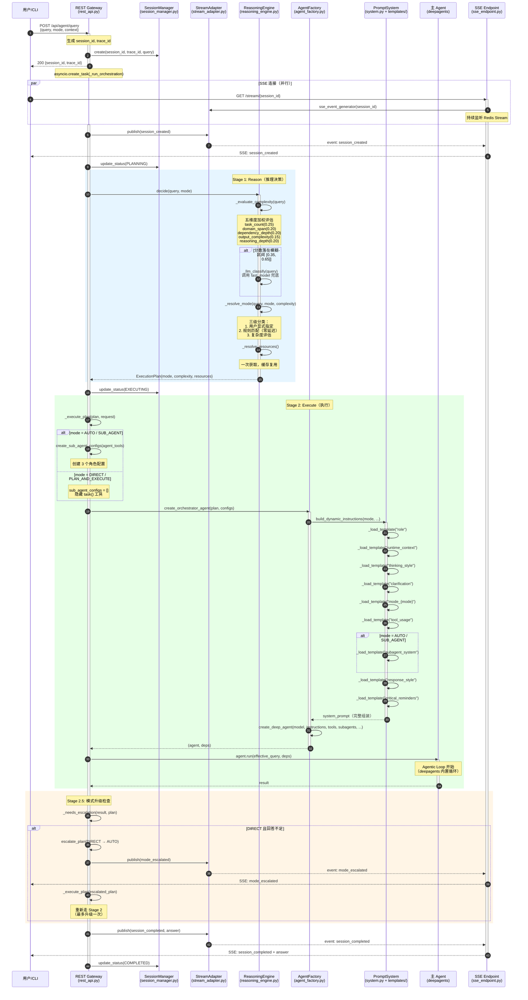
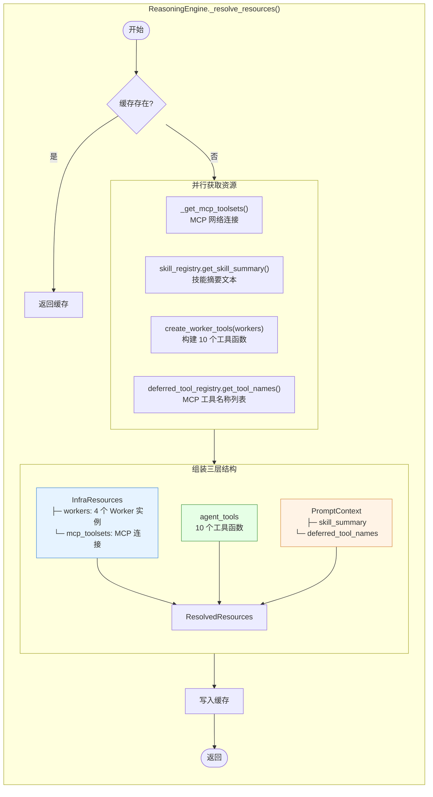
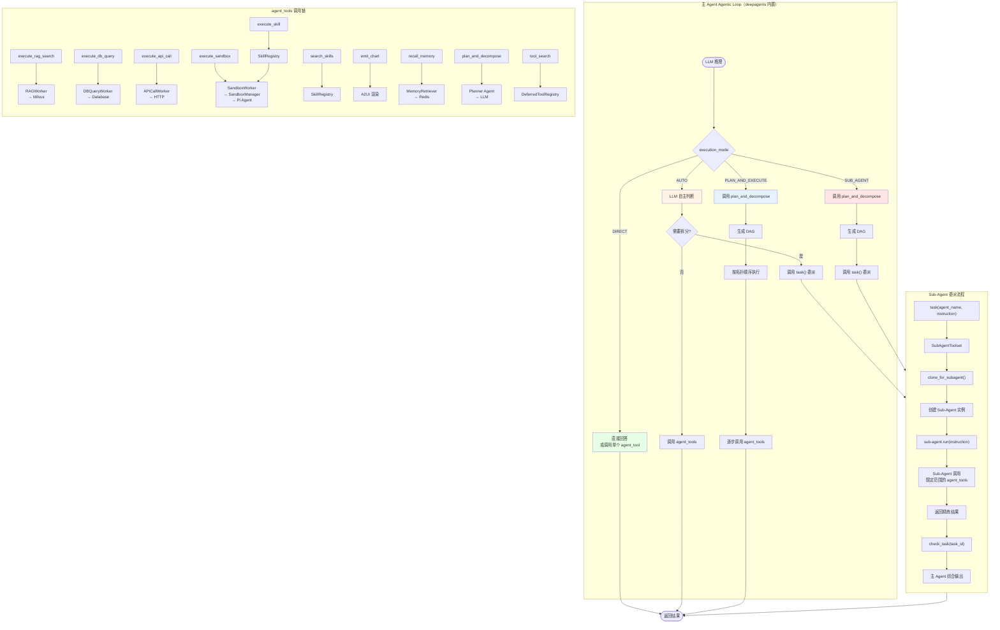
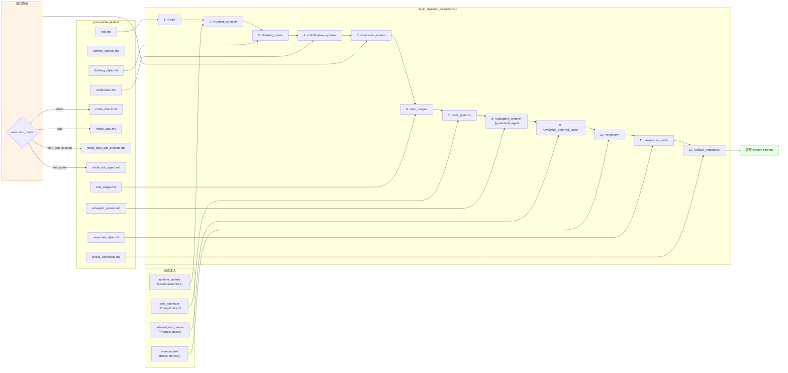
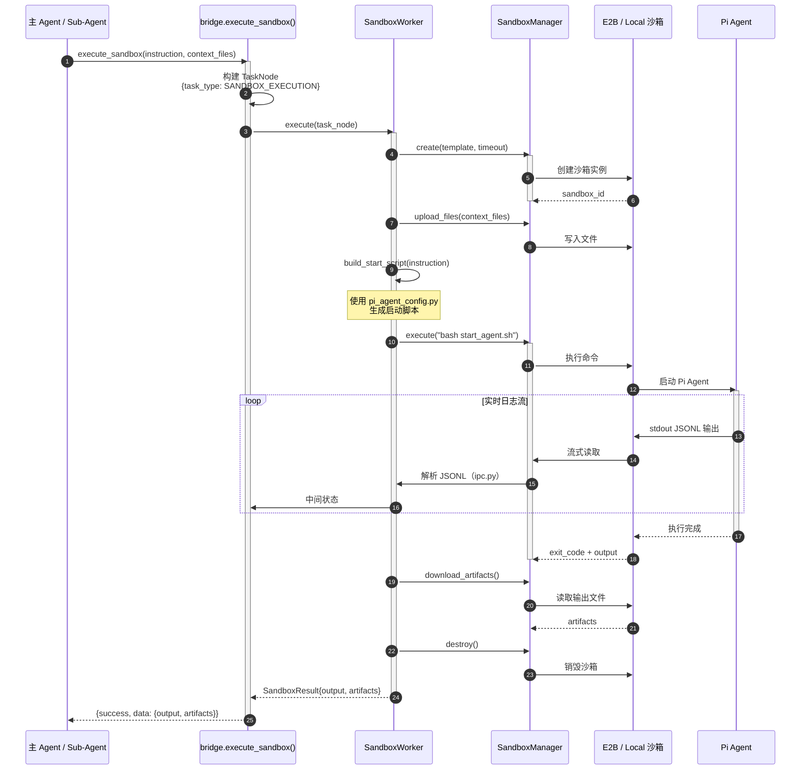
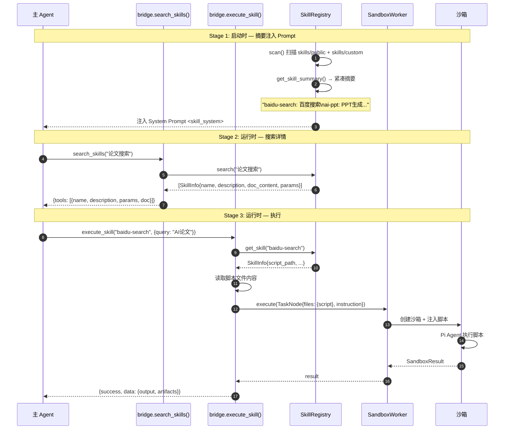
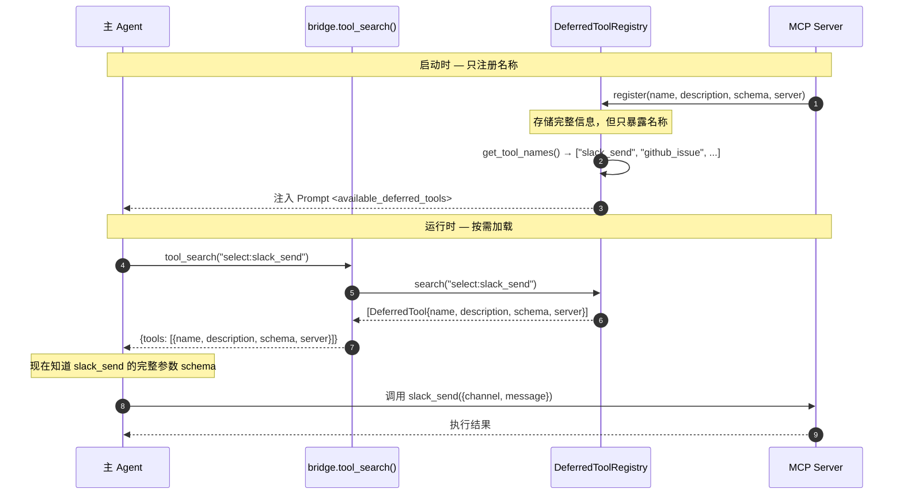

# 系统调用链路流程图

## 1. 主流程（请求 → 响应）

```mermaid
sequenceDiagram
    autonumber
    participant User as 用户/CLI
    participant GW as REST Gateway<br/>(rest_api.py)
    participant SM as SessionManager<br/>(session_manager.py)
    participant SA as StreamAdapter<br/>(stream_adapter.py)
    participant RE as ReasoningEngine<br/>(reasoning_engine.py)
    participant AF as AgentFactory<br/>(agent_factory.py)
    participant PS as PromptSystem<br/>(system.py + templates/)
    participant Agent as 主 Agent<br/>(deepagents)
    participant SSE as SSE Endpoint<br/>(sse_endpoint.py)

    User->>GW: POST /api/agent/query<br/>{query, mode, context}
    activate GW

    Note over GW: 生成 session_id, trace_id

    GW->>SM: create(session_id, trace_id, query)
    GW-->>User: 200 {session_id, trace_id}
    deactivate GW

    Note over GW: asyncio.create_task(_run_orchestration)

    par SSE 连接（并行）
        User->>SSE: GET /stream/{session_id}
        activate SSE
        SSE->>SA: sse_event_generator(session_id)
        Note over SSE: 持续监听 Redis Stream
    end

    activate GW
    GW->>SA: publish(session_created)
    SA-->>SSE: event: session_created
    SSE-->>User: SSE: session_created

    GW->>SM: update_status(PLANNING)

    %% ── Stage 1: Reason ──
    rect rgb(230, 245, 255)
        Note over RE: Stage 1: Reason（推理决策）
        GW->>RE: decide(query, mode)
        activate RE

        RE->>RE: _evaluate_complexity(query)
        Note over RE: 五维度加权评估<br/>task_count(0.25)<br/>domain_span(0.20)<br/>dependency_depth(0.20)<br/>output_complexity(0.15)<br/>reasoning_depth(0.20)

        alt 分数落在模糊区间 [0.35, 0.65]
            RE->>RE: _llm_classify(query)<br/>调用 fast_model 兜底
        end

        RE->>RE: _resolve_mode(query, mode, complexity)
        Note over RE: 三级分类：<br/>1. 用户显式指定<br/>2. 规则匹配（零延迟）<br/>3. 复杂度评估

        RE->>RE: _resolve_resources()
        Note over RE: 一次获取，缓存复用

        RE-->>GW: ExecutionPlan{mode, complexity, resources}
        deactivate RE
    end

    GW->>SM: update_status(EXECUTING)

    %% ── Stage 2: Execute ──
    rect rgb(230, 255, 230)
        Note over AF: Stage 2: Execute（执行）
        GW->>GW: _execute_plan(plan, request)

        alt mode = AUTO / SUB_AGENT
            GW->>GW: create_sub_agent_configs(agent_tools)
            Note over GW: 创建 3 个角色配置
        else mode = DIRECT / PLAN_AND_EXECUTE
            Note over GW: sub_agent_configs = []<br/>隐藏 task() 工具
        end

        GW->>AF: create_orchestrator_agent(plan, configs)
        activate AF
        AF->>PS: build_dynamic_instructions(mode, ...)
        activate PS
        PS->>PS: _load_template("role")
        PS->>PS: _load_template("runtime_context")
        PS->>PS: _load_template("thinking_style")
        PS->>PS: _load_template("clarification")
        PS->>PS: _load_template("mode_{mode}")
        PS->>PS: _load_template("tool_usage")

        alt mode = AUTO / SUB_AGENT
            PS->>PS: _load_template("subagent_system")
        end

        PS->>PS: _load_template("response_style")
        PS->>PS: _load_template("critical_reminders")
        PS-->>AF: system_prompt（完整组装）
        deactivate PS

        AF->>AF: create_deep_agent(model, instructions, tools, subagents, ...)
        AF-->>GW: (agent, deps)
        deactivate AF

        GW->>Agent: agent.run(effective_query, deps)
        activate Agent
        Note over Agent: Agentic Loop 开始<br/>（deepagents 内置循环）
        Agent-->>GW: result
        deactivate Agent
    end

    %% ── Stage 2.5: 模式升级检查 ──
    rect rgb(255, 245, 230)
        Note over GW: Stage 2.5: 模式升级检查
        GW->>GW: _needs_escalation(result, plan)
        alt DIRECT 且回答不足
            GW->>GW: escalate_plan(DIRECT → AUTO)
            GW->>SA: publish(mode_escalated)
            SA-->>SSE: event: mode_escalated
            SSE-->>User: SSE: mode_escalated
            GW->>GW: _execute_plan(escalated_plan)
            Note over GW: 重新走 Stage 2<br/>（最多升级一次）
        end
    end

    GW->>SA: publish(session_completed, answer)
    SA-->>SSE: event: session_completed
    SSE-->>User: SSE: session_completed + answer
    deactivate SSE

    GW->>SM: update_status(COMPLETED)
    deactivate GW
```

## 2. ResolvedResources 构建流程

```mermaid
flowchart TB
    subgraph RE["ReasoningEngine._resolve_resources()"]
        direction TB
        Start([开始]) --> CacheCheck{缓存存在?}
        CacheCheck -->|是| ReturnCache[返回缓存]
        CacheCheck -->|否| BuildAll

        subgraph BuildAll["并行获取资源"]
            direction LR
            MCP["_get_mcp_toolsets()<br/>MCP 网络连接"]
            Skills["skill_registry.get_skill_summary()<br/>技能摘要文本"]
            Bridge["create_worker_tools(workers)<br/>构建 10 个工具函数"]
            Deferred["deferred_tool_registry.get_tool_names()<br/>MCP 工具名称列表"]
        end

        BuildAll --> Assemble

        subgraph Assemble["组装三层结构"]
            direction TB
            Infra["InfraResources<br/>├─ workers: 4 个 Worker 实例<br/>└─ mcp_toolsets: MCP 连接"]
            AgentTools["agent_tools<br/>10 个工具函数"]
            PromptCtx["PromptContext<br/>├─ skill_summary<br/>└─ deferred_tool_names"]

            Infra --> RR["ResolvedResources"]
            AgentTools --> RR
            PromptCtx --> RR
        end

        Assemble --> Cache["写入缓存"]
        Cache --> Return([返回])
    end

    style Infra fill:#e6f3ff,stroke:#4a90d9
    style AgentTools fill:#e6ffe6,stroke:#4a9d4a
    style PromptCtx fill:#fff3e6,stroke:#d9904a
```

## 3. Agentic Loop 内部流程（四种模式）

```mermaid
flowchart TB
    subgraph AgenticLoop["主 Agent Agentic Loop（deepagents 内置）"]
        direction TB
        Start([LLM 推理]) --> ModeCheck{execution_mode}

        ModeCheck -->|DIRECT| Direct["直接回答<br/>或调用单个 agent_tool"]

        ModeCheck -->|AUTO| Auto["LLM 自主判断"]
        Auto --> AutoDecide{需要拆分?}
        AutoDecide -->|否| AutoTool["调用 agent_tools"]
        AutoDecide -->|是| AutoTask["调用 task() 委派"]

        ModeCheck -->|PLAN_AND_EXECUTE| Plan["调用 plan_and_decompose"]
        Plan --> DAG["生成 DAG"]
        DAG --> ExecDAG["按拓扑顺序执行"]
        ExecDAG --> ExecStep["逐步调用 agent_tools"]

        ModeCheck -->|SUB_AGENT| SubPlan["调用 plan_and_decompose"]
        SubPlan --> SubDAG["生成 DAG"]
        SubDAG --> Delegate["调用 task() 委派"]
    end

    subgraph ToolCalls["agent_tools 调用链"]
        direction TB
        T1["execute_rag_search"] --> W1["RAGWorker<br/>→ Milvus"]
        T2["execute_db_query"] --> W2["DBQueryWorker<br/>→ Database"]
        T3["execute_api_call"] --> W3["APICallWorker<br/>→ HTTP"]
        T4["execute_sandbox"] --> W4["SandboxWorker<br/>→ SandboxManager<br/>→ Pi Agent"]
        T5["execute_skill"] --> SK["SkillRegistry"] --> W4
        T6["search_skills"] --> SK2["SkillRegistry"]
        T7["emit_chart"] --> UI["A2UI 渲染"]
        T8["recall_memory"] --> MEM["MemoryRetriever<br/>→ Redis"]
        T9["plan_and_decompose"] --> PA["Planner Agent<br/>→ LLM"]
        T10["tool_search"] --> DTR["DeferredToolRegistry"]
    end

    subgraph SubAgentFlow["Sub-Agent 委派流程"]
        direction TB
        TaskCall["task(agent_name, instruction)"]
        TaskCall --> SAToolset["SubAgentToolset"]
        SAToolset --> Clone["clone_for_subagent()"]
        Clone --> CreateSub["创建 Sub-Agent 实例"]
        CreateSub --> SubRun["sub-agent.run(instruction)"]
        SubRun --> SubTools["Sub-Agent 调用<br/>限定范围的 agent_tools"]
        SubTools --> SubResult["返回精炼结果"]
        SubResult --> CheckTask["check_task(task_id)"]
        CheckTask --> Synthesize["主 Agent 综合输出"]
    end

    Direct --> End([返回结果])
    AutoTool --> End
    AutoTask --> SubAgentFlow
    ExecStep --> End
    Delegate --> SubAgentFlow
    SubAgentFlow --> End

    style Direct fill:#e6ffe6
    style Auto fill:#fff3e6
    style Plan fill:#e6f3ff
    style SubPlan fill:#ffe6e6
```

## 4. System Prompt 组装流程

```mermaid
flowchart LR
    subgraph Templates["prompts/templates/"]
        R["role.md"]
        RC["runtime_context.md"]
        TS["thinking_style.md"]
        CL["clarification.md"]
        MD["mode_direct.md"]
        MA["mode_auto.md"]
        MP["mode_plan_and_execute.md"]
        MS["mode_sub_agent.md"]
        TU["tool_usage.md"]
        SS["subagent_system.md"]
        RS["response_style.md"]
        CR["critical_reminders.md"]
    end

    subgraph Dynamic["动态注入"]
        SK["skill_summary<br/>（PromptContext）"]
        DT["deferred_tool_names<br/>（PromptContext）"]
        MM["memory_text<br/>（Redis Memory）"]
        RTC["runtime_context<br/>（session/user/time）"]
    end

    subgraph ModeRouter["模式路由"]
        Mode{execution_mode}
        Mode -->|direct| MD
        Mode -->|auto| MA
        Mode -->|plan_and_execute| MP
        Mode -->|sub_agent| MS
    end

    subgraph Assembly["build_dynamic_instructions()"]
        direction TB
        P1["1. &lt;role&gt;"]
        P2["2. &lt;runtime_context&gt;"]
        P3["3. &lt;thinking_style&gt;"]
        P4["4. &lt;clarification_system&gt;"]
        P5["5. &lt;execution_mode&gt;"]
        P6["6. &lt;tool_usage&gt;"]
        P7["7. &lt;skill_system&gt;"]
        P8["8. &lt;subagent_system&gt;<br/>仅 auto/sub_agent"]
        P9["9. &lt;available_deferred_tools&gt;"]
        P10["10. &lt;memory&gt;"]
        P11["11. &lt;response_style&gt;"]
        P12["12. &lt;critical_reminders&gt;"]

        P1 --> P2 --> P3 --> P4 --> P5 --> P6 --> P7 --> P8 --> P9 --> P10 --> P11 --> P12
    end

    R --> P1
    RTC --> P2
    TS --> P3
    CL --> P4
    ModeRouter --> P5
    TU --> P6
    SK --> P7
    SS --> P8
    DT --> P9
    MM --> P10
    RS --> P11
    CR --> P12

    P12 --> Final["完整 System Prompt"]

    style Final fill:#e6ffe6,stroke:#4a9d4a
    style ModeRouter fill:#fff3e6,stroke:#d9904a
```

## 5. 沙箱执行链路

```mermaid
sequenceDiagram
    autonumber
    participant Agent as 主 Agent / Sub-Agent
    participant Bridge as bridge.execute_sandbox()
    participant SW as SandboxWorker
    participant SM as SandboxManager
    participant Sandbox as E2B / Local 沙箱
    participant Pi as Pi Agent

    Agent->>Bridge: execute_sandbox(instruction, context_files)
    activate Bridge

    Bridge->>Bridge: 构建 TaskNode<br/>{task_type: SANDBOX_EXECUTION}
    Bridge->>SW: execute(task_node)
    activate SW

    SW->>SM: create(template, timeout)
    activate SM
    SM->>Sandbox: 创建沙箱实例
    Sandbox-->>SM: sandbox_id
    deactivate SM

    SW->>SM: upload_files(context_files)
    SM->>Sandbox: 写入文件

    SW->>SW: build_start_script(instruction)
    Note over SW: 使用 pi_agent_config.py<br/>生成启动脚本

    SW->>SM: execute("bash start_agent.sh")
    activate SM
    SM->>Sandbox: 执行命令
    Sandbox->>Pi: 启动 Pi Agent
    activate Pi

    loop 实时日志流
        Pi->>Sandbox: stdout JSONL 输出
        Sandbox->>SM: 流式读取
        SM->>SW: 解析 JSONL（ipc.py）
        SW->>Bridge: 中间状态
    end

    Pi-->>Sandbox: 执行完成
    deactivate Pi
    Sandbox-->>SM: exit_code + output
    deactivate SM

    SW->>SM: download_artifacts()
    SM->>Sandbox: 读取输出文件
    Sandbox-->>SM: artifacts

    SW->>SM: destroy()
    SM->>Sandbox: 销毁沙箱

    SW-->>Bridge: SandboxResult{output, artifacts}
    deactivate SW

    Bridge-->>Agent: {success, data: {output, artifacts}}
    deactivate Bridge
```

## 6. Skill 执行链路（三阶段渐进加载）

```mermaid
sequenceDiagram
    autonumber
    participant Agent as 主 Agent
    participant SearchSkill as bridge.search_skills()
    participant ExecSkill as bridge.execute_skill()
    participant Registry as SkillRegistry
    participant SW as SandboxWorker
    participant Sandbox as 沙箱

    Note over Agent,Sandbox: Stage 1: 启动时 — 摘要注入 Prompt
    Registry->>Registry: scan() 扫描 skills/public + skills/custom
    Registry->>Registry: get_skill_summary() → 紧凑摘要
    Note over Registry: "baidu-search: 百度搜索\nai-ppt: PPT生成..."
    Registry-->>Agent: 注入 System Prompt <skill_system>

    Note over Agent,Sandbox: Stage 2: 运行时 — 搜索详情
    Agent->>SearchSkill: search_skills("论文搜索")
    SearchSkill->>Registry: search("论文搜索")
    Registry-->>SearchSkill: [SkillInfo{name, description, doc_content, params}]
    SearchSkill-->>Agent: {tools: [{name, description, params, doc}]}

    Note over Agent,Sandbox: Stage 3: 运行时 — 执行
    Agent->>ExecSkill: execute_skill("baidu-search", {query: "AI论文"})
    ExecSkill->>Registry: get_skill("baidu-search")
    Registry-->>ExecSkill: SkillInfo{script_path, ...}
    ExecSkill->>ExecSkill: 读取脚本文件内容
    ExecSkill->>SW: execute(TaskNode{files: {script}, instruction})
    SW->>Sandbox: 创建沙箱 + 注入脚本
    Sandbox->>Sandbox: Pi Agent 执行脚本
    Sandbox-->>SW: SandboxResult
    SW-->>ExecSkill: result
    ExecSkill-->>Agent: {success, data: {output, artifacts}}
```

## 7. MCP 渐进式加载链路

```mermaid
sequenceDiagram
    autonumber
    participant Agent as 主 Agent
    participant ToolSearch as bridge.tool_search()
    participant DTR as DeferredToolRegistry
    participant MCP as MCP Server

    Note over Agent,MCP: 启动时 — 只注册名称
    MCP->>DTR: register(name, description, schema, server)
    Note over DTR: 存储完整信息，但只暴露名称

    DTR->>DTR: get_tool_names() → ["slack_send", "github_issue", ...]
    DTR-->>Agent: 注入 Prompt <available_deferred_tools>

    Note over Agent,MCP: 运行时 — 按需加载
    Agent->>ToolSearch: tool_search("select:slack_send")
    ToolSearch->>DTR: search("select:slack_send")
    DTR-->>ToolSearch: [DeferredTool{name, description, schema, server}]
    ToolSearch-->>Agent: {tools: [{name, description, schema, server}]}

    Note over Agent: 现在知道 slack_send 的完整参数 schema
    Agent->>MCP: 调用 slack_send({channel, message})
    MCP-->>Agent: 执行结果
```